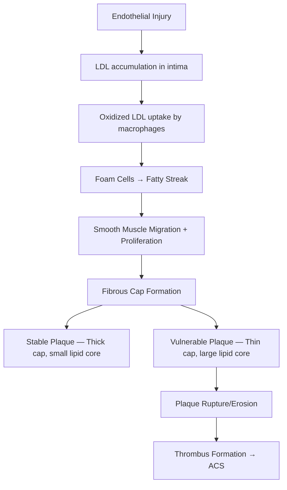

# Coronary Artery Disease — Explorer

## Overview

**Coronary artery disease (CAD)** is the leading cause of death worldwide. It encompasses **stable angina**, **acute coronary syndromes (ACS)**, and **sudden cardiac death**, all resulting from **atherosclerosis** of the coronary arteries.

## Pathogenesis of Atherosclerosis

> [!tip] **Clinical Pearl**
> It's the **vulnerable plaque** (thin fibrous cap, large lipid core, inflammatory infiltrate) that ruptures and causes ACS — NOT the most stenotic plaque.

## Risk Factors

### Non-Modifiable
- Age (M >45, F >55)
- Male sex
- Family history of premature CAD (1st degree: M <55, F <65)

### Modifiable
- **Hypertension**, **Diabetes mellitus**, **Dyslipidemia** (↑LDL, ↓HDL)
- **Smoking** (strongest modifiable risk factor)
- Obesity, sedentary lifestyle, metabolic syndrome

### Indian-Specific Risk
- Higher prevalence of **metabolic syndrome**, **insulin resistance**
- CAD presents **~10 years earlier** than Western populations
- Higher **Lp(a)** levels, **small dense LDL**

## Clinical Spectrum

| Presentation | Mechanism | ECG | Troponin |
|---|---|---|---|
| **Stable Angina** | Fixed stenosis >70% | ST depression on exercise | Normal |
| **Unstable Angina** | Partial thrombus, no necrosis | ST depression/T inversion | Normal |
| **NSTEMI** | Partial thrombus + micronecrosis | ST depression/T inversion | **Elevated** |
| **STEMI** | Complete occlusion | **ST elevation** | **Elevated** |

## ECG in ACS — Territory Localization

| Leads | Territory | Artery |
|---|---|---|
| V1-V4 | Anterior | LAD |
| V5-V6, I, aVL | Lateral | LCx |
| II, III, aVF | Inferior | RCA (85%) |
| V1-V2 (reciprocal ST depression) | Posterior | RCA/LCx |
| V3R, V4R | Right ventricle | Proximal RCA |

## Diagnosis

- **ECG** — First investigation, within 10 minutes of presentation
- **Cardiac troponins** (I or T) — Gold standard biomarker; rises 3-6 hours, peaks 24h
- **CK-MB** — Re-infarction marker (normalizes by 48-72h)
- **Echocardiography** — Regional wall motion abnormalities, EF assessment
- **Coronary angiography** — Gold standard for anatomy

## Management of STEMI

**Door-to-balloon time <90 minutes** (primary PCI) or **Door-to-needle <30 minutes** (thrombolysis)

**Acute management — MONA-B:**
- **M** — Morphine (if pain not controlled)
- **O** — Oxygen (only if SpO₂ <90%)
- **N** — Nitroglycerine (sublingual; AVOID in RV infarct, hypotension)
- **A** — Aspirin 325mg chewed + Clopidogrel/Ticagrelor
- **B** — Beta-blocker (if no contraindications)

**Reperfusion:**
- **Primary PCI** — Preferred if available within 120 min
- **Thrombolysis** — Streptokinase/Tenecteplase if PCI not available

**Secondary prevention — ABCDE:**
- **A** — Aspirin + ACE inhibitor
- **B** — Beta-blocker + BP control
- **C** — Cholesterol (high-intensity statin)
- **D** — Diet + Diabetes control
- **E** — Exercise + smoking cessation

## Lipid Management

- **Target LDL** in very high risk: <55 mg/dL
- **High-intensity statins**: Atorvastatin 40-80mg, Rosuvastatin 20-40mg
- Add **Ezetimibe** if target not met → then **PCSK9 inhibitors**
