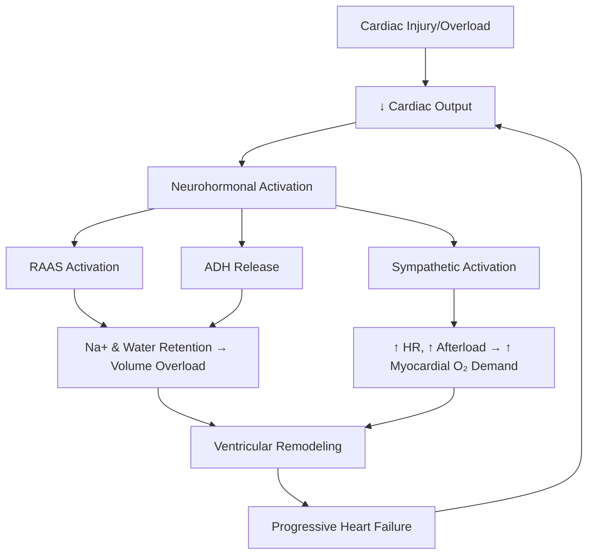

# Heart Failure — Explorer

## Overview

**Heart failure (HF)** is a clinical syndrome where the heart cannot pump sufficient blood to meet the body's metabolic demands, or can do so only at elevated filling pressures. It is the final common pathway of most cardiac diseases.

## Classification

### By Ejection Fraction
| Type | EF | Mechanism |
|---|---|---|
| **HFrEF** (Systolic) | ≤40% | Impaired contractility |
| **HFmrEF** | 41-49% | Intermediate |
| **HFpEF** (Diastolic) | ≥50% | Impaired relaxation/compliance |

### NYHA Functional Classification
| Class | Limitation |
|---|---|
| **I** | No limitation; ordinary activity OK |
| **II** | Slight limitation; comfortable at rest |
| **III** | Marked limitation; comfortable only at rest |
| **IV** | Symptoms at rest; any activity worsens |

### ACC/AHA Staging
- **A** — At risk, no structural disease (HTN, DM)
- **B** — Structural disease, no symptoms (previous MI, LVH)
- **C** — Structural disease + symptoms
- **D** — Refractory HF requiring advanced therapies

## Pathophysiology

> [!tip] **Clinical Pearl**
> Heart failure treatment targets the neurohormonal axis: ACE-I/ARB block RAAS, beta-blockers block SNS, MRAs block aldosterone. This is why they improve **survival** — unlike diuretics which only relieve symptoms.

## Clinical Features

### Left Heart Failure (Backward → Pulmonary congestion)
- **Dyspnea** on exertion → orthopnea → **PND** (paroxysmal nocturnal dyspnea)
- Bilateral basal **crepitations**
- S3 gallop (volume overload)
- **Cardiac asthma** (wheeze from bronchial edema)

### Right Heart Failure (Backward → Systemic congestion)
- **Raised JVP**, hepatojugular reflux
- **Pedal edema**, ascites, hepatomegaly
- Congestive **hepatopathy**

## Diagnosis

### Framingham Criteria (2 Major OR 1 Major + 2 Minor)

**Major:** PND, neck vein distension, rales, cardiomegaly (CXR), acute pulmonary edema, S3 gallop, hepatojugular reflux, weight loss >4.5kg with treatment

**Minor:** Bilateral ankle edema, night cough, dyspnea on exertion, hepatomegaly, pleural effusion, tachycardia (>120), ↓ vital capacity

### Investigations
- **BNP / NT-proBNP** — Best screening test; BNP >100 pg/mL or NT-proBNP >300 pg/mL suggests HF
- **Echocardiography** — Gold standard for assessment (EF, wall motion, valves, diastolic function)
- **CXR** — Cardiomegaly (CTR >0.5), cephalization, Kerley B lines, pleural effusion, bat-wing edema
- **ECG** — LVH, AF, Q waves, BBB

> [!warning] **High-Yield**
> BNP is elevated in HF but also in renal failure, PE, and sepsis. BNP is **falsely low** in obesity (adipose tissue has neprilysin that degrades BNP).

## Management of HFrEF

### Drugs That Improve Survival (the "Fantastic Four")
1. **ACE-I/ARB** (or ARNI — Sacubitril/Valsartan)
2. **Beta-blockers** — Carvedilol, Bisoprolol, Metoprolol succinate
3. **MRA** — Spironolactone, Eplerenone
4. **SGLT2 inhibitors** — Dapagliflozin, Empagliflozin

### Symptom Relief
- **Loop diuretics** (Furosemide) — Volume overload; does NOT improve survival
- **Digoxin** — Reduces hospitalizations, does NOT reduce mortality
- **Hydralazine + Isosorbide dinitrate** — If ACE-I/ARB contraindicated

### Device Therapy
- **ICD** — EF ≤35% for sudden cardiac death prevention
- **CRT** — EF ≤35% + LBBB + QRS ≥150ms

### Acute Decompensated HF
- Sit up, oxygen, IV furosemide, IV nitroglycerine
- If cardiogenic shock → inotropes (dobutamine) ± IABP
