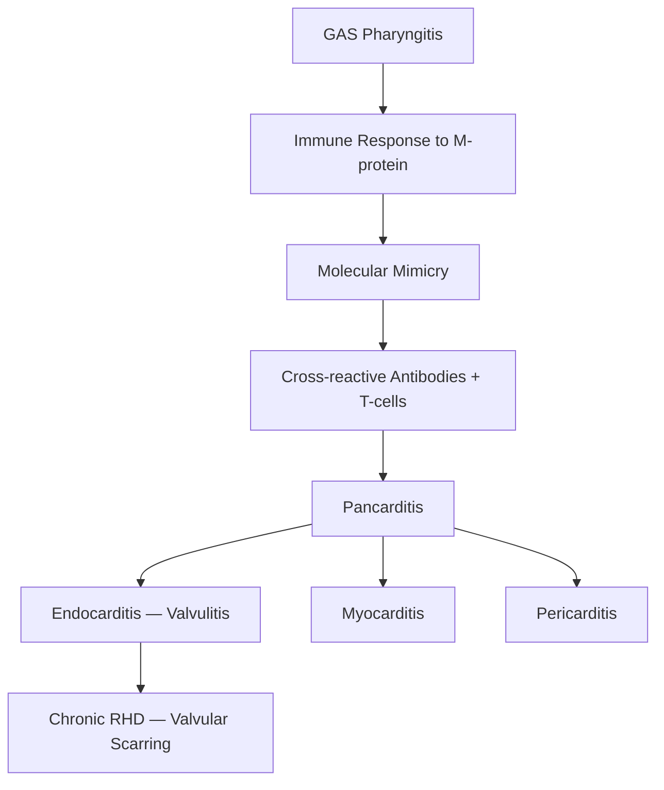

# Rheumatic Heart Disease — Explorer

## Overview

**Rheumatic heart disease (RHD)** is the most common acquired heart disease in children and young adults in developing countries. It results from **acute rheumatic fever (ARF)**, an autoimmune response to **Group A Streptococcal (GAS)** pharyngitis.

## Pathogenesis

**Molecular mimicry** is the key mechanism. GAS M-protein shares epitopes with cardiac myosin, laminin, and valve glycoproteins. Cross-reactive antibodies and T-cells attack heart tissue.

**Aschoff bodies** (pathognomonic granulomatous lesions) with **Anitschkow cells** (owl-eye nuclei) are the hallmark histological findings.

## Jones Criteria (2015 Revised)

Diagnosis of ARF requires **evidence of preceding GAS infection** PLUS:
- **2 major criteria**, OR
- **1 major + 2 minor criteria**

### Major Criteria

| Low-Risk Populations | High-Risk Populations (India) |
|---|---|
| Carditis (clinical/subclinical) | Carditis (clinical/subclinical) |
| Polyarthritis | Mono/polyarthritis or polyarthralgia |
| Chorea | Chorea |
| Erythema marginatum | Erythema marginatum |
| Subcutaneous nodules | Subcutaneous nodules |

### Minor Criteria
- **Fever** (≥38.5°C low-risk; ≥38°C high-risk)
- **Polyarthralgia** (low-risk) / Monoarthralgia (high-risk)
- **Elevated ESR/CRP**
- **Prolonged PR interval**

> [!tip] **Clinical Pearl**
> In high-risk populations (like India), monoarthritis alone qualifies as a major criterion. This is a common exam trick!

## Clinical Features of ARF

- **Carditis** (50-70%): Pansystolic murmur of MR, Carey Coombs murmur (mid-diastolic), pericardial rub
- **Migratory polyarthritis** (75%): Large joints, fleeting, extremely painful, responds dramatically to aspirin
- **Sydenham chorea** (10-30%): Involuntary movements, emotional lability, "milkmaid grip," appears weeks-months later
- **Erythema marginatum** (<5%): Erythematous rings on trunk, evanescent
- **Subcutaneous nodules** (<5%): Painless, over bony prominences

## Chronic RHD — Valvular Involvement

Order of valve involvement: **Mitral > Aortic > Tricuspid > Pulmonary**

- **Mitral stenosis (MS)**: Most common chronic lesion. Fish-mouth/buttonhole valve, LA enlargement → AF → thromboembolism
- **Mitral regurgitation (MR)**: Most common in acute carditis
- **Aortic stenosis/regurgitation**: Often combined with mitral disease

> [!warning] **High-Yield**
> Mitral stenosis is NEVER caused acutely — it takes years of scarring. If an exam asks about acute RHD valvular lesion → MR.

## Complications
- Heart failure (most common cause of death)
- Atrial fibrillation (especially in MS)
- Thromboembolism / stroke
- Infective endocarditis
- Pulmonary hypertension

## Prevention

| Level | Strategy |
|---|---|
| **Primordial** | Improve living conditions, reduce overcrowding |
| **Primary** | Treat GAS pharyngitis (Penicillin V × 10 days or single IM Benzathine penicillin) |
| **Secondary** | Long-term Benzathine penicillin G every 3-4 weeks |

**Duration of secondary prophylaxis:**
- ARF without carditis: 5 years or until age 21
- ARF with carditis (no residual disease): 10 years or until age 21
- ARF with carditis + residual valve disease: 10 years or until age 40 (sometimes lifelong)
