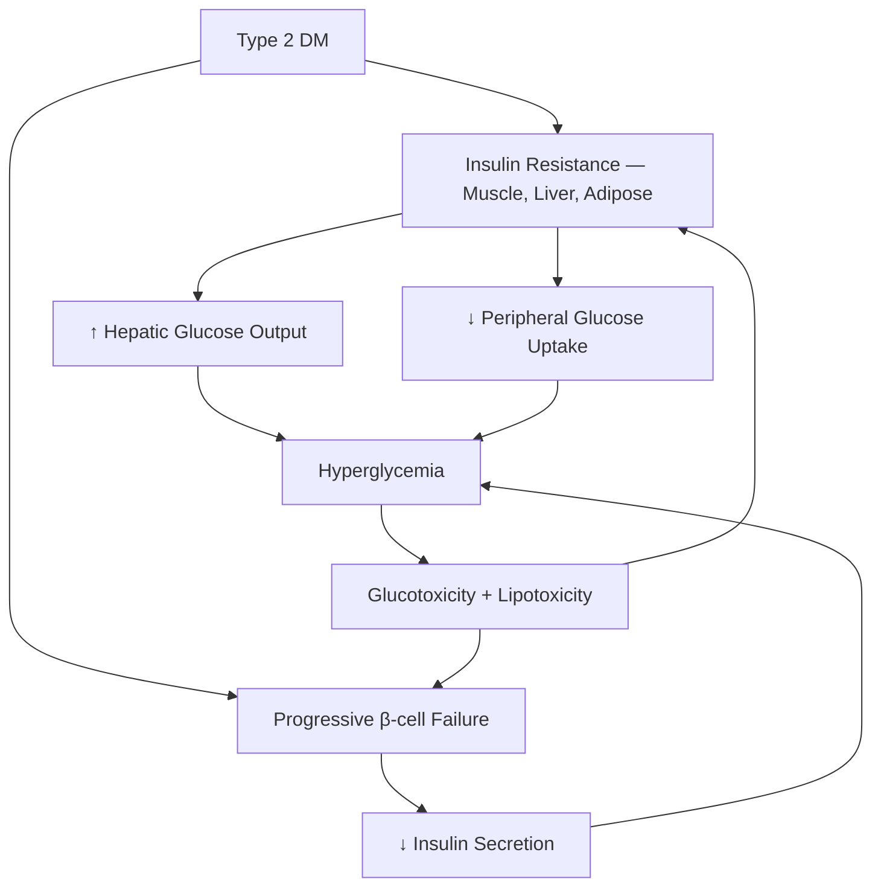

# Diabetes Mellitus — Explorer

## Overview

**Diabetes mellitus (DM)** is a group of metabolic disorders characterized by chronic **hyperglycemia** due to defective insulin secretion, action, or both. India is the "diabetes capital" with >100 million diabetics.

## Classification

| Type | Mechanism | Key Features |
|---|---|---|
| **Type 1** | Autoimmune β-cell destruction | Young, lean, absolute insulin deficiency, DKA-prone |
| **Type 2** | Insulin resistance + relative deficiency | Older, obese, metabolic syndrome, gradual onset |
| **GDM** | Glucose intolerance in pregnancy | Screen at 24-28 weeks |
| **Others** | MODY, pancreatitis, steroids, endocrinopathies | Specific causes |

## Diagnostic Criteria (ADA)

| Test | Normal | Prediabetes | Diabetes |
|---|---|---|---|
| Fasting glucose | <100 | 100-125 (IFG) | **≥126** |
| 2h OGTT | <140 | 140-199 (IGT) | **≥200** |
| HbA1c | <5.7% | 5.7-6.4% | **≥6.5%** |
| Random glucose | — | — | **≥200 + symptoms** |

## Pathophysiology

## Complications

### Microvascular (specific to DM)
- **Retinopathy**: Non-proliferative → Proliferative (neovascularization). Screen annually.
- **Nephropathy**: Microalbuminuria → macroalbuminuria → ESRD. ACE-I/ARB are renoprotective.
- **Neuropathy**: Distal symmetric polyneuropathy (glove-stocking), autonomic neuropathy, mononeuropathies

### Macrovascular (accelerated atherosclerosis)
- **CAD** (most common cause of death in DM)
- Stroke, peripheral vascular disease

> [!tip] **Clinical Pearl**
> **Diabetic foot** results from neuropathy (loss of sensation) + PVD (poor healing) + infection. It's the most common cause of non-traumatic lower limb amputation.

## Oral Hypoglycemic Agents

| Drug | Mechanism | Key Points |
|---|---|---|
| **Metformin** | ↓ Hepatic glucose output, ↑ insulin sensitivity | First-line T2DM. Avoid in renal failure (lactic acidosis). No hypoglycemia. |
| **Sulfonylureas** (Glimepiride) | ↑ Insulin secretion from β-cells | Weight gain, **hypoglycemia** |
| **SGLT2i** (Dapagliflozin) | Block glucose reabsorption in PCT | Weight loss, CV + renal benefit, UTI, **euglycemic DKA** |
| **DPP-4i** (Sitagliptin) | ↑ Incretin levels | Weight neutral, well tolerated |
| **GLP-1 RA** (Liraglutide) | Incretin mimetic | Weight loss, CV benefit, injectable |
| **TZDs** (Pioglitazone) | ↑ Insulin sensitivity (PPARγ) | Weight gain, fluid retention, contraindicated in heart failure |
| **Acarbose** | α-glucosidase inhibitor | ↓ Post-prandial glucose, flatulence |

## Insulin Types

| Type | Onset | Peak | Duration |
|---|---|---|---|
| **Rapid** (Lispro, Aspart) | 5-15 min | 1-2h | 3-5h |
| **Short** (Regular) | 30-60 min | 2-4h | 6-8h |
| **Intermediate** (NPH) | 1-2h | 4-8h | 12-16h |
| **Long** (Glargine, Detemir) | 1-2h | None (flat) | 20-24h |

## DKA vs HHS

| Feature | DKA | HHS |
|---|---|---|
| Type | Usually Type 1 | Usually Type 2 |
| Glucose | 300-800 | **>600** (often >1000) |
| Ketones | **++++** | Minimal/absent |
| pH | **<7.3** (metabolic acidosis) | >7.3 |
| Osmolality | Mildly elevated | **>320** |
| Mental status | Alert to obtunded | **Stupor/coma** |
| Mortality | ~1-5% | **~15-20%** |

### DKA Management: **"FIG-PICK"**
- **F** — Fluids (NS initially → 0.45% when Na normalizes)
- **I** — Insulin (IV regular, 0.1 U/kg/h)
- **G** — Glucose monitoring (add D5 when glucose <250)
- **P** — Potassium replacement (before insulin if K <3.3)
- **I** — Identify and treat precipitant (Infection #1)
- **C** — Correct acidosis (bicarb only if pH <6.9)
- **K** — Keep monitoring (q1-2h electrolytes)

> [!warning] **High-Yield**
> **Always check potassium before starting insulin in DKA**. Insulin drives K⁺ intracellularly → fatal hypokalemia. If K <3.3 → replace K first, then start insulin.
