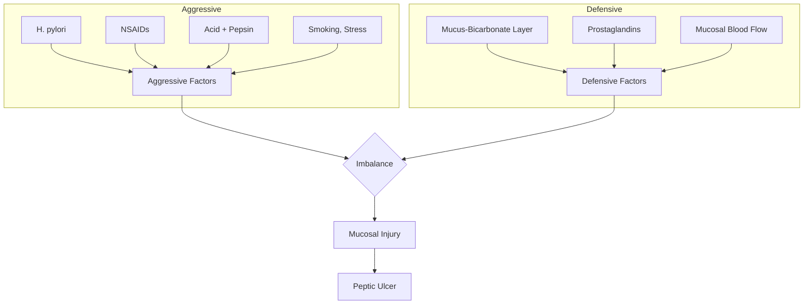

# Acid Peptic Disease — Explorer

## Overview

**Peptic ulcer disease (PUD)** involves mucosal breaks in the stomach or duodenum extending through the muscularis mucosae. The two major causes are **H. pylori infection** (most common) and **NSAID use**.

## Pathophysiology

The balance between **aggressive factors** (acid, pepsin, H. pylori, NSAIDs, bile) and **defensive factors** (mucus-bicarbonate barrier, prostaglandins, mucosal blood flow, epithelial renewal) determines ulcer formation.

## H. pylori

- **Gram-negative spiral bacterium** that colonizes gastric mucosa
- Produces **urease** → converts urea to ammonia → alkalinizes local environment
- Causes chronic active gastritis → PUD → gastric MALT lymphoma → gastric adenocarcinoma

### Diagnosis
| Test | Type | Notes |
|---|---|---|
| **Urea breath test** | Non-invasive | Gold standard for eradication confirmation |
| **Stool antigen** | Non-invasive | Good for diagnosis and follow-up |
| **Serology (IgG)** | Non-invasive | Cannot distinguish active vs past; not for follow-up |
| **Rapid urease test (CLO)** | Invasive (biopsy) | Quick, at endoscopy |
| **Histology** | Invasive | Gold standard for diagnosis |

> [!warning] **High-Yield**
> Stop **PPIs for 2 weeks** and **antibiotics for 4 weeks** before UBT or stool antigen — otherwise false negatives!

### Treatment — Triple Therapy (14 days)
- **PPI** (Omeprazole 20mg BD) + **Amoxicillin** 1g BD + **Clarithromycin** 500mg BD
- Alternative: **Bismuth quadruple therapy** (PPI + Bismuth + Metronidazole + Tetracycline)

## Gastric vs Duodenal Ulcer

| Feature | Gastric Ulcer | Duodenal Ulcer |
|---|---|---|
| Frequency | Less common | More common (4:1) |
| Pain | Worse with food | Relieved by food, worse at night |
| Weight | Loss (afraid to eat) | Gain (eating relieves pain) |
| Location | Lesser curvature | First part of duodenum (anterior wall) |
| Malignancy risk | Yes (always biopsy) | No |
| H. pylori | 70% | 95% |
| Acid secretion | Normal or ↓ | ↑ (due to antral gastritis → ↑ gastrin) |

> [!tip] **Clinical Pearl**
> **Anterior duodenal ulcers perforate** (→ peritonitis). **Posterior duodenal ulcers bleed** (erode into gastroduodenal artery).

## Upper GI Bleeding

### Forrest Classification (Endoscopic)

| Class | Description | Rebleed Risk |
|---|---|---|
| Ia | Spurting hemorrhage | 55% |
| Ib | Oozing hemorrhage | 55% |
| IIa | Visible vessel | 43% |
| IIb | Adherent clot | 22% |
| IIc | Flat pigmented spot | 10% |
| III | Clean base | 5% |

**Management:** IV PPI infusion (80mg bolus then 8mg/h for 72h) + endoscopic therapy (Forrest Ia-IIb)

## Zollinger-Ellison Syndrome

- **Gastrinoma** (usually in pancreas/duodenum) → excess gastrin → massive acid hypersecretion
- Multiple/recurrent ulcers, diarrhea, ulcers distal to duodenal bulb
- Diagnosis: **Fasting gastrin >1000 pg/mL** + **secretin stimulation test** (paradoxical rise)
- Associated with **MEN-1** (3 Ps: Parathyroid + Pituitary + Pancreas)
- Treatment: High-dose PPI + tumor localization + surgical resection
