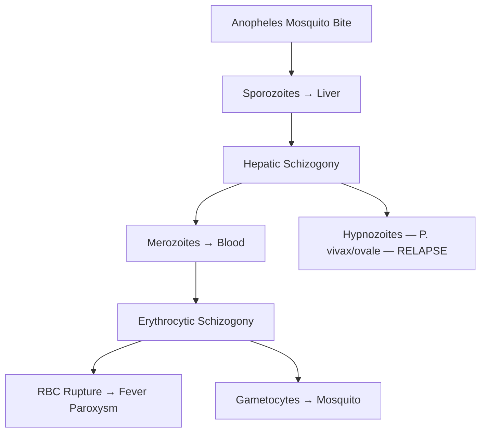

# Tropical Infections — Explorer

## Overview

India's tropical climate makes **malaria, dengue, typhoid, leptospirosis, and scrub typhus** extremely common causes of acute febrile illness. Rapid diagnosis and treatment are critical.

## Malaria

### Causative Agents
- **P. falciparum** — Most dangerous, cerebral malaria, severe anemia, multi-organ failure
- **P. vivax** — Most common in India, relapses (hypnozoites in liver)
- P. ovale, P. malariae, P. knowlesi

### Lifecycle & Pathogenesis

### Clinical Features
- **Fever paroxysms**: Cold stage → Hot stage → Sweating stage
- P. vivax: 48h cycle (benign tertian); P. malariae: 72h (quartan); P. falciparum: irregular
- **Severe malaria (P. falciparum)**: Cerebral malaria (coma), severe anemia, ARDS, AKI, hypoglycemia, DIC, acidosis

### Diagnosis
- **Peripheral blood smear** (thick + thin) — Gold standard. Thick = screening, Thin = speciation
- **Rapid diagnostic test (RDT)** — HRP2 (P. falciparum), pLDH (all species)
- **Banana-shaped gametocytes** = P. falciparum

### Treatment
| Type | Drug |
|---|---|
| Uncomplicated P. vivax | **Chloroquine** × 3 days + **Primaquine** × 14 days (anti-relapse) |
| Uncomplicated P. falciparum | **ACT** (Artemisinin-based Combination Therapy) |
| Severe malaria | **IV Artesunate** (drug of choice) |
| Anti-relapse (vivax/ovale) | **Primaquine** (check G6PD before!) |

> [!warning] **High-Yield**
> **Check G6PD before primaquine** — causes severe hemolysis in G6PD-deficient patients.

## Dengue

- **Aedes aegypti** mosquito, Flavivirus, 4 serotypes
- **Second infection** with different serotype → severe dengue (antibody-dependent enhancement)
- Phases: **Febrile** (1-7d) → **Critical** (day 3-7, defervescence = danger) → **Recovery**
- **NS1 antigen** — positive in first 5 days. IgM after day 5.
- Thrombocytopenia, hemoconcentration (↑ Hct), transaminitis
- **NO aspirin/NSAIDs** (bleeding risk). Supportive care + IV fluids.
- **Dengue warning signs**: Abdominal pain, persistent vomiting, hepatomegaly, rising Hct with falling platelets, mucosal bleed, lethargy

> [!tip] **Clinical Pearl**
> In dengue, the **critical phase coincides with defervescence** — patients feel better but are at highest risk for shock. Monitor closely during this period.

## Typhoid (Enteric Fever)

- **Salmonella typhi** — feco-oral route, contaminated water/food
- Week 1: Stepladder fever, relative bradycardia. Week 2: Rose spots, hepatosplenomegaly. Week 3: Complications (perforation, hemorrhage)
- **Widal test**: Rising titre (≥4-fold) supportive but unreliable. **Blood culture** = gold standard (Week 1)
- Treatment: **Azithromycin** or **Ceftriaxone** (fluoroquinolone resistance increasing)
- Complications: **Ileal perforation** (3rd week), GI hemorrhage, osteomyelitis (sickle cell)

## Leptospirosis

- **Leptospira interrogans** — contact with animal urine/contaminated water (floods!)
- Biphasic: Leptospiremic phase (fever, myalgia, conjunctival suffusion) → Immune phase
- **Weil disease** (severe): Jaundice + AKI + hemorrhage
- Diagnosis: **MAT (Microscopic Agglutination Test)** — gold standard
- Treatment: **Doxycycline** (mild), **IV Penicillin G** (severe)

## Scrub Typhus

- **Orientia tsutsugamushi**, transmitted by **Trombiculid mite** (chigger) larva
- **Eschar** at bite site (pathognomonic) + fever + lymphadenopathy + rash
- Complications: ARDS, meningoencephalitis, myocarditis, AKI
- Diagnosis: **IgM ELISA**, Weil-Felix (OXK positive — screening only)
- Treatment: **Doxycycline** (drug of choice) or Azithromycin (pregnancy/children)
