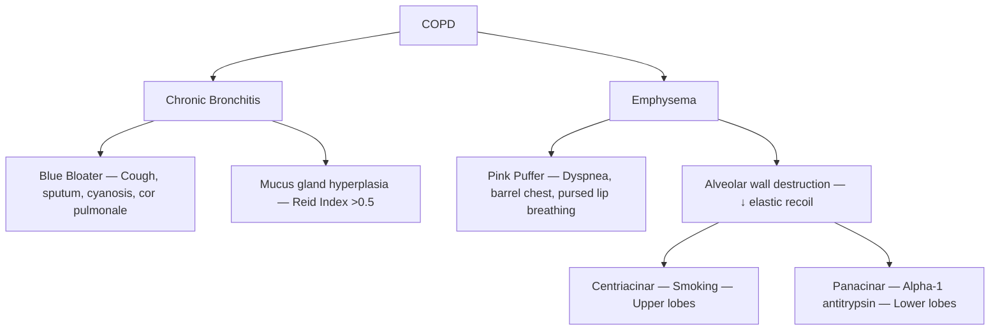

# COPD & Asthma — Explorer

## Overview

**COPD** and **Asthma** are the two most common **obstructive airway diseases**. Both show reduced airflow, but differ fundamentally in reversibility, pathology, and management approach.

## COPD vs Asthma — Key Differences

| Feature | COPD | Asthma |
|---|---|---|
| Age | >40 years | Any age (often childhood) |
| Smoking | Almost always | Not required |
| Reversibility | **Irreversible** (partially) | **Reversible** |
| Inflammation | Neutrophilic | Eosinophilic |
| Airway changes | Destruction (emphysema) + mucus (bronchitis) | Hyperresponsiveness, remodeling |
| FEV1/FVC | <0.70 post-bronchodilator | Normalizes with treatment |

## COPD

### Pathology — Two Phenotypes

### GOLD Staging (Post-bronchodilator FEV1/FVC <0.70)

| Stage | FEV1 (% predicted) |
|---|---|
| GOLD 1 (Mild) | ≥80% |
| GOLD 2 (Moderate) | 50-79% |
| GOLD 3 (Severe) | 30-49% |
| GOLD 4 (Very severe) | <30% |

### COPD Management
- **Smoking cessation** — ONLY intervention proven to slow FEV1 decline
- **LAMA** (Tiotropium) or **LABA** (Formoterol/Salmeterol) — maintenance
- **LAMA + LABA** — if symptomatic on monotherapy
- **Add ICS** — ONLY if eosinophils ≥300 or frequent exacerbations with asthma overlap
- **Oxygen therapy** — If PaO₂ <55 mmHg (or <60 with cor pulmonale) → improves survival
- **Pulmonary rehabilitation** — Improves quality of life

> [!warning] **High-Yield**
> Only **smoking cessation** and **long-term oxygen therapy** improve survival in COPD. Bronchodilators improve symptoms, not mortality.

### Acute Exacerbation of COPD
- Triggers: Infection (most common), pollution, non-compliance
- Treatment: **Nebulized SABA + SAMA** (salbutamol + ipratropium) + **systemic steroids** (prednisolone 40mg × 5 days) + **antibiotics** (if purulent sputum) + **controlled O₂** (target SpO₂ 88-92%)

> [!tip] **Clinical Pearl**
> **Never give high-flow O₂** in COPD exacerbation — these patients have hypoxic drive. High O₂ → ↓ respiratory drive → CO₂ narcosis.

## Asthma

### Pathophysiology
- **Type I hypersensitivity** (IgE-mediated) + airway hyperresponsiveness
- Eosinophilic inflammation → bronchospasm + mucus + edema → reversible airflow obstruction
- **Charcot-Leyden crystals** (eosinophil breakdown), **Curschmann spirals** (mucus casts), **Creola bodies** (epithelial clusters) in sputum

### Diagnosis
- **Spirometry**: FEV1/FVC <0.70 with **≥12% and ≥200mL improvement** post-bronchodilator
- **Peak flow variability** >20%
- **Methacholine challenge** — if spirometry normal but asthma suspected (↑ airway hyperresponsiveness)

### Stepwise Therapy (GINA 2024)

| Step | Controller | Reliever |
|---|---|---|
| 1-2 | Low-dose ICS-formoterol PRN | As-needed ICS-formoterol |
| 3 | Low-dose ICS-formoterol maintenance | As-needed ICS-formoterol |
| 4 | Medium-dose ICS-formoterol | As-needed ICS-formoterol |
| 5 | Add LAMA, high-dose ICS, anti-IgE/IL5 | As-needed ICS-formoterol |

### Acute Severe Asthma
- **Nebulized salbutamol** (continuous) + **ipratropium** + **IV hydrocortisone/oral prednisolone**
- If life-threatening: **IV MgSO₄**, IV aminophylline, consider intubation
- **Silent chest** = ominous sign (no air movement = severe obstruction)

### Life-Threatening Features
PaO₂ <60, SpO₂ <92%, PaCO₂ normal/raised (should be LOW in acute asthma), silent chest, cyanosis, bradycardia, altered consciousness
