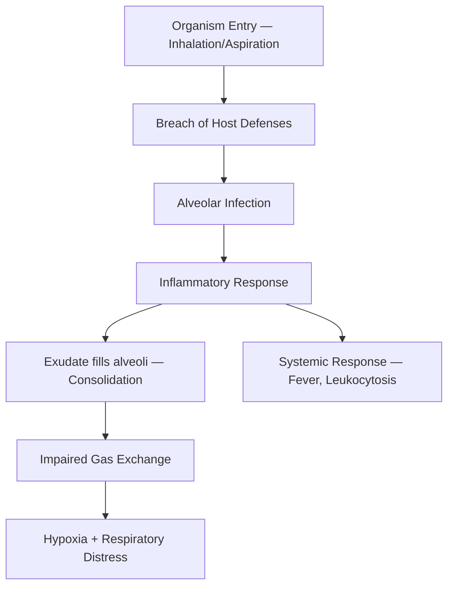

# Pneumonia & Respiratory Infections — Explorer

## Overview

**Pneumonia** is infection of the lung parenchyma causing consolidation. It remains a leading cause of morbidity and mortality, especially in extremes of age and immunocompromised patients.

## Classification

| Type | Definition | Common Organisms |
|---|---|---|
| **CAP** | Acquired outside hospital | S. pneumoniae (#1), H. influenzae, Atypicals |
| **HAP** | ≥48h after admission | Gram-negatives (Pseudomonas, Klebsiella), MRSA |
| **VAP** | ≥48h after intubation | Pseudomonas, Acinetobacter, MRSA |
| **Aspiration** | Inhalation of oropharyngeal contents | Anaerobes, mixed flora |

## Pathogenesis

## Organism-Based Approach (High-Yield)

| Organism | Key Clues |
|---|---|
| **S. pneumoniae** | Rusty sputum, lobar consolidation, most common CAP |
| **Klebsiella** | Alcoholics, "currant jelly" sputum, upper lobe, cavitation |
| **Staphylococcus** | Post-influenza, pneumatoceles, empyema |
| **Mycoplasma** | Young adults, dry cough, bullous myringitis, cold agglutinins |
| **Legionella** | AC/cooling towers, hyponatremia, diarrhea, elevated LFTs |
| **PCP (Pneumocystis)** | HIV (CD4 <200), bilateral ground-glass opacity, ↑LDH |
| **Pseudomonas** | Cystic fibrosis, bronchiectasis, ICU patients |

> [!tip] **Clinical Pearl**
> **Atypical pneumonia** (Mycoplasma, Chlamydia, Legionella) presents with dry cough, low-grade fever, headache, and CXR worse than clinical exam suggests. Interstitial pattern on CXR.

## CURB-65 Severity Score (CAP)

| Parameter | Points |
|---|---|
| **C** — Confusion (new) | 1 |
| **U** — Urea >7 mmol/L (BUN >19) | 1 |
| **R** — Respiratory rate ≥30 | 1 |
| **B** — Blood pressure (SBP <90 or DBP ≤60) | 1 |
| **65** — Age ≥65 | 1 |

- **0-1** → Outpatient
- **2** → Short hospitalization / supervised outpatient
- **3-5** → ICU admission consideration

## CXR Patterns

| Pattern | Diagnosis |
|---|---|
| **Lobar consolidation** | Typical bacterial (S. pneumoniae) |
| **Bronchopneumonia** (patchy) | S. aureus, gram-negatives |
| **Interstitial/reticular** | Atypical (Mycoplasma, viral) |
| **Cavitation** | TB, Klebsiella, S. aureus, anaerobes |
| **Bilateral ground-glass** | PCP, viral (COVID, influenza) |
| **Air-fluid level** | Lung abscess |

## Management

### CAP — Empiric Therapy
- **Outpatient (mild):** Amoxicillin OR Azithromycin/Doxycycline
- **Inpatient (moderate):** β-lactam (Ceftriaxone/Amoxicillin-clavulanate) + Macrolide
- **ICU (severe):** β-lactam + Macrolide (or Respiratory FQ)
- **Pseudomonas risk:** Piperacillin-tazobactam + Fluoroquinolone

### HAP/VAP
- **Anti-pseudomonal β-lactam** (Piperacillin-tazobactam / Meropenem) ± Vancomycin/Linezolid (if MRSA risk)

## Complications
- **Parapneumonic effusion** → if pH <7.2 or pus → **empyema** → chest tube drainage
- Lung abscess, ARDS, sepsis, multi-organ failure

> [!warning] **High-Yield**
> Always get a **CXR** in suspected pneumonia. A normal CXR with strong clinical suspicion → repeat in 24-48h or do CT chest.
