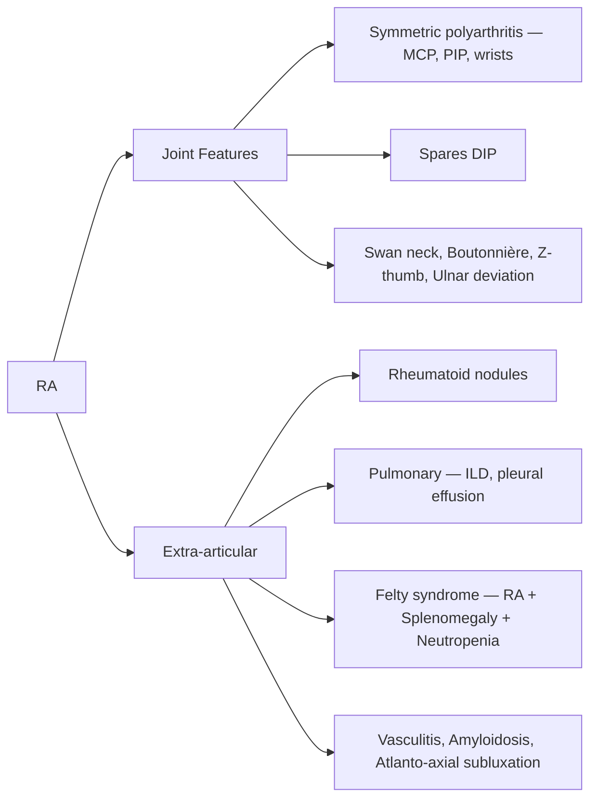

# Joint Diseases — Explorer

## Overview

Joint diseases are broadly classified as **inflammatory** (RA, gout, SLE, seronegative spondyloarthropathies) and **degenerative** (osteoarthritis). Distinguishing them is a fundamental clinical skill.

## Inflammatory vs Degenerative Arthritis

| Feature | Inflammatory | Degenerative (OA) |
|---|---|---|
| Morning stiffness | >30 min (often >1 hour) | <30 min ("gelling") |
| Joint swelling | Soft, warm, boggy | Bony, hard |
| ESR/CRP | Elevated | Normal |
| Pattern | Symmetric, small joints (RA) | Weight-bearing, asymmetric |
| Systemic features | Fever, fatigue, weight loss | None |

## Rheumatoid Arthritis (RA)

**Chronic systemic autoimmune disease** primarily affecting synovial joints.

### 2010 ACR/EULAR Classification Criteria (Score ≥6/10)
- **Joint involvement** (0-5): 1 large (0), 2-10 large (1), 1-3 small (2), 4-10 small (3), >10 with ≥1 small (5)
- **Serology** (0-3): RF− and ACPA− (0), low-positive (2), high-positive (3)
- **Acute phase reactants** (0-1): Normal CRP and ESR (0), abnormal (1)
- **Duration** (0-1): <6 weeks (0), ≥6 weeks (1)

> [!tip] **Clinical Pearl**
> **ACPA (Anti-CCP)** is more specific than RF for RA (~95% specificity vs ~85%). RF is also positive in SLE, Sjögren's, infections, and even healthy elderly.

### RA Treatment Ladder
1. **NSAIDs** — Symptom relief only
2. **DMARDs** — Start early! **Methotrexate** = anchor drug (with folic acid supplementation)
3. **Biologics** — TNF-α inhibitors (Infliximab, Adalimumab), Rituximab, Tocilizumab — if DMARD-refractory
4. **JAK inhibitors** — Tofacitinib (oral targeted therapy)

## Osteoarthritis (OA)

- **Most common joint disease** worldwide
- Degenerative — loss of articular cartilage + subchondral sclerosis + osteophyte formation
- Joints: **Knees, hips, DIP (Heberden's nodes), PIP (Bouchard's nodes), 1st CMC**
- XR: Joint space narrowing, osteophytes, subchondral sclerosis, subchondral cysts
- Treatment: Weight loss, exercise, paracetamol, topical NSAIDs → oral NSAIDs → intra-articular steroids → joint replacement

## Gout

- **Monosodium urate (MSU) crystal** deposition disease
- **Negatively birefringent** needle-shaped crystals under polarized microscopy (yellow when parallel)
- Acute: 1st MTP (**podagra**) — excruciating, red, swollen
- Chronic: **Tophi** (urate deposits in soft tissue)
- Treatment: Acute — **Colchicine, NSAIDs, steroids** (NOT allopurinol). Prophylaxis — **Allopurinol** (xanthine oxidase inhibitor), **Febuxostat**

> [!warning] **High-Yield**
> **Never start/stop allopurinol during acute gout** — it worsens the attack by mobilizing urate crystals.

## Pseudogout
- **Calcium pyrophosphate (CPPD)** crystals — **positively birefringent**, rhomboid-shaped
- Commonly affects **knee**
- XR: **Chondrocalcinosis** (linear calcification in cartilage)

## Systemic Lupus Erythematosus (SLE)

- **Multisystem autoimmune disease**, predominantly young females (F:M = 9:1)
- **ANA** — Most sensitive (>95%) but not specific
- **Anti-dsDNA** — Specific, correlates with disease activity and **lupus nephritis**
- **Anti-Smith** — Most specific for SLE

### SLICC Criteria highlights
- Malar (butterfly) rash, discoid rash, photosensitivity, oral ulcers
- Arthritis (non-erosive), serositis, nephritis (Class III-V most serious)
- Hematologic: Hemolytic anemia, leukopenia, thrombocytopenia
- **Anti-phospholipid syndrome** — Recurrent thrombosis, pregnancy loss

## ANA Patterns

| Pattern | Associated Antibody | Disease |
|---|---|---|
| Homogeneous | Anti-dsDNA, Anti-histone | SLE, Drug-induced lupus |
| Speckled | Anti-Sm, Anti-RNP, Anti-Ro, Anti-La | SLE, Sjögren's, MCTD |
| Nucleolar | Anti-Scl-70 (topoisomerase I) | Systemic sclerosis (diffuse) |
| Centromere | Anti-centromere | Limited systemic sclerosis (CREST) |
