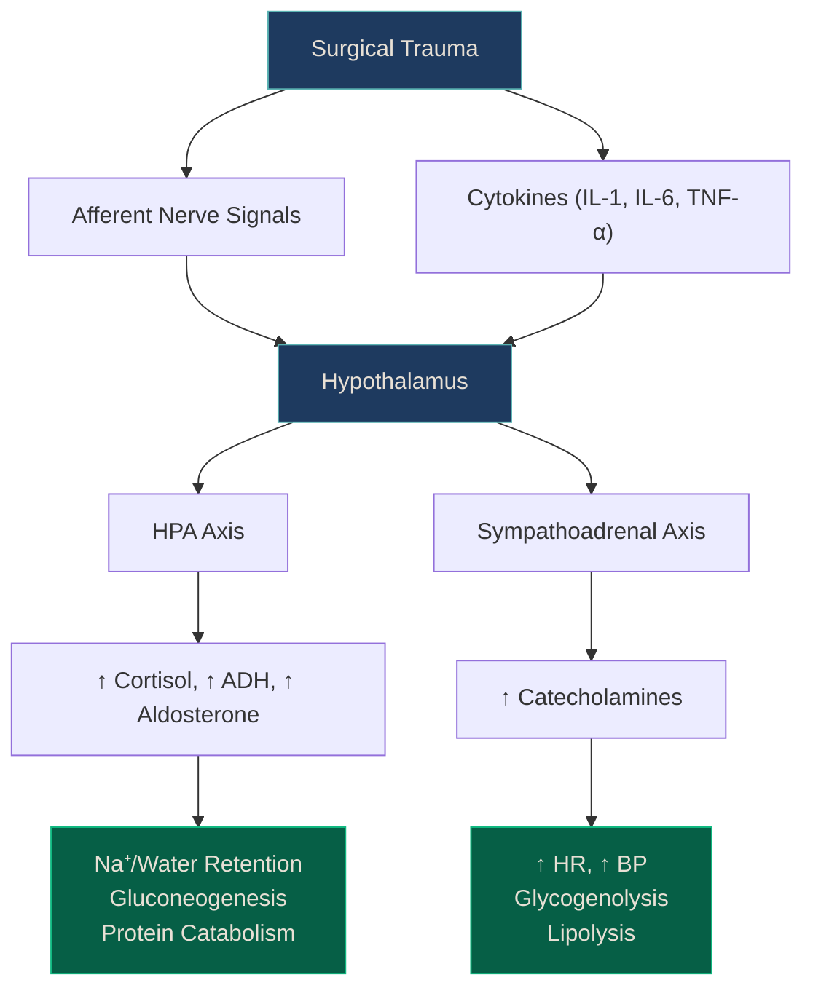

# Homeostasis & Metabolic Response to Surgery

> *NucleuX Academy — Surgery > General Topics*
> *Sources: Sabiston 22nd Ed Ch.3, Schwartz 11th Ed Ch.2*

---

## 1. Introduction

**[UG]** Every surgical procedure — from a minor skin excision to a major laparotomy — triggers a predictable cascade of **neuroendocrine**, **metabolic**, and **immunological** responses. Understanding this **metabolic response to injury** is foundational to perioperative care, fluid management, and nutritional support.

The body perceives surgery as controlled trauma. The ensuing response evolved to promote survival: mobilize energy, retain salt and water, fight infection, and heal wounds. While adaptive in short bursts, a prolonged or exaggerated response leads to catabolism, organ dysfunction, and delayed recovery.^[Sabiston 22nd, Ch.3, p.48-62]

---

## 2. The Neuroendocrine Response

**[UG]** The metabolic response to surgery is initiated by **afferent nerve signals** from the site of injury and by **circulating mediators** (cytokines, complement fragments). These converge on the **hypothalamus**, triggering two major axes:

### 2.1 Hypothalamic-Pituitary-Adrenal (HPA) Axis

| Hormone | Source | Effect |
|---------|--------|--------|
| **CRH** | Hypothalamus | Stimulates ACTH release |
| **ACTH** | Anterior pituitary | Stimulates cortisol from adrenal cortex |
| **Cortisol** | Adrenal cortex | Gluconeogenesis, protein catabolism, anti-inflammatory, immunosuppression |
| **ADH (Vasopressin)** | Posterior pituitary | Water retention, vasoconstriction |
| **Aldosterone** | Adrenal cortex (via RAAS) | Sodium and water retention, potassium excretion |

**[UG]** **Cortisol** is the master stress hormone — it peaks within 4–6 hours of surgery and may remain elevated for 24–72 hours depending on the magnitude of injury.

### 2.2 Sympathoadrenal Response

**[UG]** The **sympathetic nervous system** activates alongside the HPA axis, releasing **catecholamines** (adrenaline and noradrenaline) from the **adrenal medulla** and sympathetic nerve endings.

| Effect | Mechanism |
|--------|-----------|
| Tachycardia | β1 stimulation |
| Vasoconstriction | α1 stimulation |
| Glycogenolysis | Hepatic β2 stimulation |
| Lipolysis | β3 stimulation in adipose tissue |
| Reduced insulin secretion | α2 on pancreatic β-cells |

---

## 3. Phases of the Metabolic Response

**[UG]** Sir David Cuthbertson (1932) described two distinct metabolic phases following injury:

| Phase | Duration | Metabolic State | Key Features |
|-------|----------|----------------|--------------|
| **Ebb phase** | 0–24 hours | Hypometabolic | ↓ Metabolic rate, ↓ cardiac output, ↓ O₂ consumption, ↓ body temperature |
| **Flow phase** | Days 2–7+ | Hypermetabolic | ↑ Metabolic rate, ↑ cardiac output, ↑ O₂ consumption, catabolism dominant |

**[PG]** The **flow phase** is further subdivided:
- **Catabolic phase** (days 2–7): Negative nitrogen balance, muscle proteolysis, gluconeogenesis from amino acids, lipolysis
- **Anabolic phase** (days 7+): Positive nitrogen balance, tissue repair, weight regain

<strong style="color: #6EE7B7;">Clinical Pearl:</strong> The magnitude of the metabolic response is proportional to the extent of tissue injury — a laparoscopic cholecystectomy triggers far less response than an open colectomy. This is a key advantage of <strong>minimally invasive surgery</strong>.

---

## 4. Metabolic Consequences

### 4.1 Carbohydrate Metabolism

**[UG]** Surgery induces **stress hyperglycaemia** — even in non-diabetics. Mechanisms include:
- ↑ Gluconeogenesis (cortisol, glucagon)
- ↑ Glycogenolysis (catecholamines)
- **Insulin resistance** (cytokine-mediated, especially TNF-α and IL-6)

**[PG]** Perioperative hyperglycaemia (`blood glucose >180 mg/dL`) is associated with increased wound infection rates, impaired neutrophil function, and higher mortality in critically ill patients.^[Schwartz 11th, Ch.2]

### 4.2 Protein Metabolism

**[UG]** The catabolic response causes **net protein breakdown**, reflected by:
- Negative **nitrogen balance** (urinary nitrogen excretion > intake)
- Skeletal muscle proteolysis (provides amino acids for gluconeogenesis and acute-phase protein synthesis)
- ↑ Hepatic synthesis of **acute-phase proteins** (CRP, fibrinogen, ferritin, haptoglobin)
- ↓ **Negative acute-phase proteins** (albumin, transferrin, pre-albumin)

| Acute-Phase Protein | Direction | Clinical Use |
|---------------------|-----------|-------------|
| **CRP** | ↑↑↑ | Inflammation marker, peaks day 2–3 |
| **Fibrinogen** | ↑↑ | ↑ ESR, thrombotic risk |
| **Albumin** | ↓↓ | Falls rapidly — NOT a reliable nutritional marker acutely |
| **Pre-albumin (Transthyretin)** | ↓ | Better short-term nutritional marker (t½ = 2 days) |

### 4.3 Fat Metabolism

**[UG]** Lipolysis is stimulated by catecholamines and cortisol, releasing **free fatty acids (FFAs)** and **glycerol**. FFAs become the primary fuel source during the flow phase, sparing glucose for the brain and wound.

### 4.4 Water and Electrolyte Changes

**[UG]** Post-surgical fluid retention is driven by:
- ↑ ADH → water retention → dilutional hyponatraemia
- ↑ Aldosterone → sodium retention, potassium loss
- **Third-space losses** — fluid sequestration in injured tissues and peritoneal cavity

| Electrolyte Change | Mechanism |
|-------------------|-----------|
| Hyponatraemia | ADH-mediated water retention (dilutional) |
| Hypokalaemia | Aldosterone-driven renal K⁺ loss |
| Fluid retention | ADH + aldosterone + third-spacing |
| Post-operative diuresis (day 2–4) | Resolution of third-space fluid |

<strong style="color: #67E8F9;">Exam Tip:</strong> Post-operative hyponatraemia in the first 24–48 hours is usually <strong>dilutional</strong> (excess ADH), not from sodium loss. Treatment is <strong>fluid restriction</strong>, not saline infusion.

---

## 5. The Cytokine Response

**[PG]** Tissue injury activates the innate immune system, releasing pro-inflammatory cytokines:

| Cytokine | Source | Key Actions |
|----------|--------|-------------|
| **TNF-α** | Macrophages | Fever, acute-phase response, insulin resistance, cachexia |
| **IL-1** | Macrophages | Fever (acts on hypothalamus), T-cell activation |
| **IL-6** | Macrophages, T-cells | Major driver of acute-phase protein synthesis (CRP) |
| **IL-10** | T-cells, macrophages | Anti-inflammatory — balances the pro-inflammatory cascade |

**[PG]** The balance between pro-inflammatory (**SIRS**) and anti-inflammatory (**CARS** — Compensatory Anti-inflammatory Response Syndrome) responses determines outcome. Overwhelming SIRS leads to organ failure; excessive CARS leads to immunosuppression and sepsis.

<strong style="color: #FCA5A5;">[SS]</strong> The concept of <strong>PICS (Persistent Inflammation, Immunosuppression, and Catabolism Syndrome)</strong> describes ICU patients who survive the initial insult but enter a chronic state of low-grade inflammation with concurrent immunosuppression — leading to recurrent infections, poor wound healing, and prolonged ICU stay. PICS is increasingly recognized as a major driver of late mortality in surgical critical care.^[Sabiston 22nd, Ch.3]

---

## 6. Modifying the Metabolic Response

**[PG]** Modern perioperative care (ERAS — Enhanced Recovery After Surgery) aims to attenuate the metabolic response:

| Strategy | Mechanism | Evidence |
|----------|-----------|---------|
| **Minimally invasive surgery** | Less tissue trauma → less cytokine release | ↓ CRP, ↓ cortisol, faster recovery |
| **Epidural anaesthesia** | Blocks afferent nerve signals to hypothalamus | ↓ Cortisol, ↓ catecholamines, preserves insulin sensitivity |
| **Preoperative carbohydrate loading** | ↓ Insulin resistance, maintains glycogen stores | Maltodextrin drink 2h before surgery |
| **Early enteral nutrition** | Maintains gut barrier, ↓ bacterial translocation | Reduces infectious complications |
| **Glycaemic control** | Insulin infusion to target `140–180 mg/dL` | ↓ Wound infection, ↓ mortality in ICU |
| **NSAIDs / COX-2 inhibitors** | ↓ Prostaglandin-mediated inflammation | Opioid-sparing, ↓ ileus |

<strong style="color: #6EE7B7;">Clinical Pearl:</strong> The ERAS protocol is not a single intervention but a <strong>bundle</strong> of 20+ evidence-based elements. The cumulative effect of the bundle exceeds the sum of individual components — compliance with ≥70% of elements is associated with significantly better outcomes.

---

## 7. Clinical Relevance — Putting It Together

**[UG]** Understanding the metabolic response explains common post-operative findings:

| Post-op Finding | Explanation |
|----------------|-------------|
| Mild fever (day 1–2) | Cytokine-mediated (IL-1, IL-6) — NOT necessarily infection |
| Oliguria (day 0–1) | ADH + aldosterone → water retention |
| Hyperglycaemia | Cortisol + catecholamines + insulin resistance |
| Tachycardia | Sympathoadrenal activation + pain |
| Negative nitrogen balance | Protein catabolism for gluconeogenesis |
| Weight gain (day 1–3) | Fluid retention → diuresis follows by day 3–5 |
| ↓ Albumin | Negative acute-phase response + dilution + capillary leak |

---

## 8. Key Points Summary

**[UG] — Must-Know:**
- Surgery triggers a neuroendocrine response via HPA and sympathoadrenal axes
- Cuthbertson's ebb (hypometabolic) and flow (hypermetabolic) phases
- Cortisol is the master stress hormone; peaks at 4–6 hours
- Stress hyperglycaemia occurs even in non-diabetics
- Post-op oliguria and hyponatraemia are ADH/aldosterone-driven

**[PG] — High-Yield:**
- IL-6 is the primary driver of CRP and acute-phase protein synthesis
- SIRS-CARS balance determines surgical outcome
- ERAS protocols attenuate the metabolic response
- Epidural anaesthesia blocks afferent signalling to hypothalamus
- Pre-albumin (t½ 2 days) is better than albumin for short-term nutritional monitoring

**[SS] — Pearls:**
- PICS (Persistent Inflammation, Immunosuppression, Catabolism Syndrome) explains late ICU mortality
- Tight glycaemic control (140–180 mg/dL) reduces complications; too-tight (<110) increases hypoglycaemia risk

---

<strong style="color: #A78BFA;">References:</strong> 
• Sabiston Textbook of Surgery, 22nd Ed, Ch.3 (p.48-62) 
• Schwartz's Principles of Surgery, 11th Ed, Ch.2 
• Desborough JP. The stress response to trauma and surgery. Br J Anaesth. 2000;85(1):109-117

---

> *NucleuX Academy — Where Knowledge Condenses*
