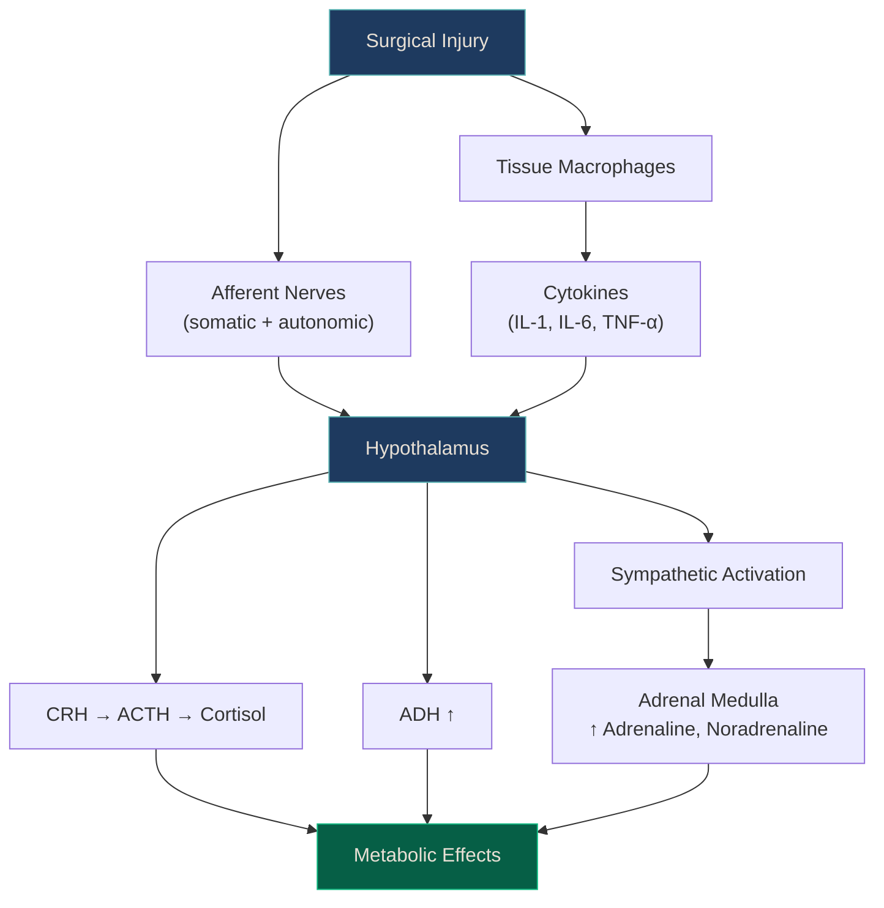
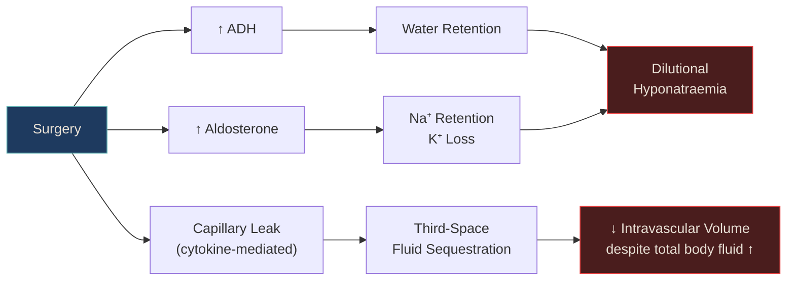

# Chapter: Homeostasis & Metabolic Response to Surgery

> *NucleuX Originals — Surgery Series*
> *Written by ATOM · Faculty Reviewed*

---

**Depth Key:** **[UG]** Undergraduate Essential · **[PG]** Postgraduate Depth · **[SS]** Superspecialty Pearl

---

## 1. History — The Discovery of Surgical Stress

**[UG]** The concept that the body responds to injury in a predictable, measurable way was first articulated by **Sir David Cuthbertson** in 1932. Working in Glasgow, he observed that patients with long-bone fractures had dramatically increased urinary nitrogen excretion — evidence of massive protein breakdown — even when they were not moving. He termed this the **"metabolic response to injury"** and described the now-classic **ebb** and **flow** phases.^[Sabiston 22nd, Ch.3]

**Francis D. Moore** at the Peter Bent Brigham Hospital (Harvard) extended this work in the 1950s, meticulously documenting the fluid, electrolyte, and protein changes through surgical convalescence. His monograph *Metabolic Care of the Surgical Patient* (1959) defined **four phases of surgical recovery** that remain clinically relevant today.^[Schwartz 11th, Ch.2]

| Year | Milestone |
|------|-----------|
| 1932 | **Cuthbertson** — Ebb and flow phases described |
| 1936 | **Hans Selye** — General Adaptation Syndrome (GAS) |
| 1959 | **Francis Moore** — Four phases of surgical convalescence |
| 1992 | Bone et al. — SIRS/CARS concept formalized |
| 2001 | **Kehlet** — ERAS protocol introduced (fast-track surgery) |
| 2001 | Van den Berghe — Intensive insulin therapy trial (Leuven) |
| 2009 | NICE-SUGAR trial — Moderate glucose control is safer |

<strong style="color: #A78BFA;">References:</strong> 
• Sabiston Textbook of Surgery, 22nd Ed, Ch.3 (p.48-52) 
• Schwartz's Principles of Surgery, 11th Ed, Ch.2 (p.15-20)

---

## 2. Anatomy of the Stress Response — Neuroendocrine Axes

**[UG]** The metabolic response begins with **signal transduction** from the injury site to the central nervous system via two pathways:

1. **Neural (afferent):** Nociceptive and somatic afferents from the wound → spinal cord → hypothalamus
2. **Humoral (cytokine):** Tissue macrophages release **IL-1**, **IL-6**, **TNF-α** → systemic circulation → hypothalamus and liver

**[UG]** The **hypothalamus** orchestrates the response through:

| Axis | Key Hormones | Net Effect |
|------|-------------|------------|
| **HPA axis** | CRH → ACTH → Cortisol | Gluconeogenesis, protein catabolism, anti-inflammatory |
| **Posterior pituitary** | ADH (vasopressin) | Water retention, vasoconstriction |
| **RAAS** | Renin → Angiotensin II → Aldosterone | Na⁺ retention, K⁺ excretion, vasoconstriction |
| **Sympathoadrenal** | Adrenaline, noradrenaline | ↑ HR, ↑ BP, glycogenolysis, lipolysis |
| **Somatotropic** | Growth hormone ↑ | Lipolysis, insulin resistance |
| **Pancreatic** | Glucagon ↑, Insulin ↓ (early) | Hyperglycaemia |

**[PG]** The **magnitude** of the neuroendocrine response is directly proportional to:
- Extent of tissue dissection and injury
- Duration of surgery
- Degree of blood loss
- Presence of infection or contamination
- Patient's pre-existing nutritional and immunological status

This is why **minimally invasive surgery** produces a significantly attenuated hormonal response compared to open surgery — less tissue trauma means fewer afferent signals and less cytokine release.^[Sabiston 22nd, Ch.3, p.54]

---

## 3. Pathophysiology — Metabolic Consequences

### 3.1 Carbohydrate Metabolism

**[UG]** **Stress hyperglycaemia** is a hallmark of the surgical stress response. It results from:
- ↑ **Gluconeogenesis** (cortisol, glucagon drive hepatic glucose production from amino acids and glycerol)
- ↑ **Glycogenolysis** (catecholamines mobilize hepatic glycogen)
- **Peripheral insulin resistance** (TNF-α and IL-6 impair insulin receptor signalling in skeletal muscle)

**[PG]** Unlike starvation (where insulin levels fall and ketogenesis provides an alternative fuel), surgical stress induces hyperglycaemia *despite* adequate or even elevated insulin levels. The key defect is **end-organ resistance** — muscle and adipose tissue fail to take up glucose normally. The brain and wound continue to consume glucose (glucose transport is insulin-independent in these tissues).^[Schwartz 11th, Ch.2]

| Feature | Starvation | Surgical Stress |
|---------|-----------|-----------------|
| Insulin | ↓↓ | Normal or ↑ (but ineffective) |
| Glucagon | ↑ | ↑↑ |
| Blood glucose | ↓ or normal | ↑↑ (stress hyperglycaemia) |
| Ketogenesis | ↑↑ (adaptive) | Suppressed (insulin present) |
| Primary fuel | Ketone bodies | Glucose + FFAs |
| Proteolysis | Minimized (adaptive) | Accelerated (maladaptive) |

<strong style="color: #FCA5A5;">High Yield:</strong> In starvation, the body adapts by switching to ketone bodies and minimizing proteolysis. In surgical stress, insulin resistance prevents this adaptation — leading to continued protein catabolism and muscle wasting. This is why <strong>surgical patients lose muscle faster than starving patients</strong>.

### 3.2 Protein Metabolism

**[UG]** Surgical stress triggers **accelerated skeletal muscle proteolysis**. The released amino acids serve three purposes:
1. **Gluconeogenesis** — alanine and glutamine converted to glucose in the liver
2. **Acute-phase protein synthesis** — liver reprioritizes to produce CRP, fibrinogen, complement
3. **Wound healing** — substrate for fibroblast activity and collagen synthesis

The clinical marker is **negative nitrogen balance** — urinary nitrogen excretion exceeds intake. A major operation can cause loss of 10–15 g nitrogen/day (equivalent to ~60–90 g protein or ~300 g lean muscle mass per day).^[Sabiston 22nd, Ch.3, p.57]

**[PG]** The liver undergoes a dramatic **reprioritization** of protein synthesis:

| Protein Category | Direction | Examples |
|-----------------|-----------|---------|
| **Positive acute-phase** | ↑↑ | CRP (↑ up to 1000×), fibrinogen, ferritin, haptoglobin, α1-antitrypsin |
| **Negative acute-phase** | ↓↓ | Albumin, transferrin, pre-albumin, retinol-binding protein |
| **Constitutive** | ↓ | General synthetic function depressed |

### 3.3 Fat Metabolism

**[UG]** **Lipolysis** is activated by catecholamines (via hormone-sensitive lipase in adipose tissue), releasing **free fatty acids (FFAs)** and glycerol. FFAs become the primary energy source during the flow phase, undergoing β-oxidation in muscle and liver.

**[PG]** Glycerol released from lipolysis enters the gluconeogenic pathway in the liver. FFAs also serve as substrates for ketogenesis, but in surgical stress, the presence of insulin (even if relatively insufficient) suppresses ketone body production — unlike pure starvation.

### 3.4 Fluid and Electrolyte Changes

**[UG]** Post-operative fluid retention is one of the most clinically relevant consequences:

**[UG]** Key electrolyte changes:

| Parameter | Change | Mechanism | Timeline |
|-----------|--------|-----------|----------|
| **Sodium** | ↓ (dilutional) | ADH → water retention | Day 0–2 |
| **Potassium** | ↓ | Aldosterone → renal K⁺ loss | Day 0–3 |
| **Urine output** | ↓ (oliguria) | ADH + aldosterone | Day 0–1 |
| **Body weight** | ↑ (1–3 kg) | Fluid retention | Day 1–3 |
| **Diuresis** | Spontaneous ↑ | Resolution of third-space | Day 3–5 |

<strong style="color: #FCD34D;">Warning:</strong> Do not chase post-operative oliguria with excessive IV fluids in the first 24 hours. The reduced urine output is a <strong>physiological response</strong> (ADH-mediated), not necessarily hypovolaemia. Over-resuscitation leads to pulmonary oedema, anastomotic oedema, and delayed recovery.

---

## 4. Clinical Presentation — Post-operative Physiology

**[UG]** Knowledge of the metabolic response explains common post-operative findings that are **physiological** (not pathological):

| Finding | Day | Mechanism | Action |
|---------|-----|-----------|--------|
| Low-grade fever | 1–2 | IL-1, IL-6 (cytokine) | Observe — no antibiotics needed |
| Tachycardia | 0–2 | Catecholamines + pain | Analgesia, volume assessment |
| Oliguria | 0–1 | ADH + aldosterone | Expected — don't over-resuscitate |
| Hyperglycaemia | 0–3 | Cortisol + insulin resistance | Monitor; insulin if >180 mg/dL |
| Weight gain | 1–3 | Fluid retention | Expected — diuresis follows |
| ↓ Albumin | 1–3 | Negative acute-phase + dilution | Not malnutrition — don't infuse albumin |

**[PG]** Atypical or exaggerated responses should raise concern:

| Red Flag | Concern |
|----------|---------|
| Fever >38.5°C after day 3 | Surgical site infection, pneumonia, UTI, DVT |
| Persistent tachycardia | Ongoing bleeding, PE, sepsis |
| Oliguria despite adequate resuscitation | Renal injury, urinary obstruction |
| Glucose >250 mg/dL refractory to insulin | Undiagnosed diabetes, sepsis |

---

## 5. Diagnosis & Investigations

**[UG]** There is no "diagnostic test" for the metabolic response per se — it is a physiological process. However, monitoring its markers guides clinical management:

| Marker | What It Tells You | Frequency |
|--------|-------------------|-----------|
| **Blood glucose** | Insulin resistance severity | Every 4–6h post-op (ICU: hourly) |
| **Serum electrolytes** | Na⁺/K⁺ shifts, fluid status | Daily |
| **CRP** | Magnitude of inflammatory response | Day 2, 4, 7 (trending) |
| **Nitrogen balance** | Protein catabolism vs anabolism | Weekly in prolonged ICU stay |
| **Pre-albumin** | Short-term nutritional status | Twice weekly if nutritional concern |
| **Urine output** | Volume status + ADH effect | Hourly (catheterised patients) |
| **Lactate** | Tissue perfusion adequacy | As needed (especially in shock) |

---

## 6. Classification — Phases of Surgical Convalescence

**[UG]** Two major classification systems describe the temporal evolution:

### Cuthbertson's Phases (1932)

| Phase | Timing | Characteristics |
|-------|--------|----------------|
| **Ebb** | 0–24h | ↓ Metabolic rate, ↓ CO, ↓ temperature, shock-like |
| **Flow (Catabolic)** | Day 2–7 | ↑ Metabolic rate, negative N₂ balance, hyperglycaemia |
| **Flow (Anabolic)** | Day 7+ | Positive N₂ balance, wound healing, weight regain |

### Moore's Four Phases (1959)

| Phase | Name | Duration | Key Feature |
|-------|------|----------|-------------|
| 1 | **Adrenergic-corticoid** | Day 0–3 | Injury response, catabolism |
| 2 | **Corticoid withdrawal** | Day 3–7 | Turning point, diuresis begins |
| 3 | **Anabolic** | Day 7–weeks | Muscle strength returns, positive N₂ balance |
| 4 | **Fat gain** | Weeks–months | Full recovery, weight regain as adipose |

<strong style="color: #67E8F9;">Exam Tip:</strong> Moore's Phase 2 (corticoid withdrawal) is the <strong>"turning point"</strong> — the patient begins to mobilize third-space fluid (spontaneous diuresis) and transitions from catabolism to anabolism. A failure to enter this phase suggests ongoing sepsis or complications.

---

## 7. Management — Attenuating the Response

### 7.1 ERAS (Enhanced Recovery After Surgery)

**[PG]** The **ERAS protocol**, pioneered by **Henrik Kehlet** in Denmark, is the most comprehensive strategy to attenuate the metabolic response:

| ERAS Element | Rationale |
|-------------|-----------|
| **Preoperative counselling** | Reduces anxiety → ↓ cortisol |
| **No prolonged fasting** | Carb loading 2h pre-op → ↓ insulin resistance |
| **Epidural anaesthesia** | Blocks afferent nerves → ↓ HPA activation |
| **Minimally invasive approach** | Less tissue trauma → ↓ cytokines |
| **Goal-directed fluid therapy** | Avoids over-resuscitation → ↓ oedema |
| **Early oral nutrition** | Maintains gut barrier → ↓ bacterial translocation |
| **Early mobilization** | ↓ Catabolism, ↓ DVT, ↓ pneumonia |
| **Multimodal analgesia** | NSAIDs + paracetamol + regional → ↓ opioid use |

### 7.2 Glycaemic Control

**[PG]** Perioperative hyperglycaemia management:

| Study | Target | Outcome |
|-------|--------|---------|
| **Van den Berghe (2001)** | `80–110 mg/dL` (intensive) | ↓ Mortality in surgical ICU |
| **NICE-SUGAR (2009)** | `140–180 mg/dL` (conventional) | Better outcomes — intensive control → hypoglycaemia |
| **Current consensus** | `140–180 mg/dL` | Adopted by most guidelines |

<strong style="color: #FCA5A5;">[SS]</strong> The Van den Berghe trial (Leuven, 2001) showed mortality benefit with intensive insulin therapy in surgical ICU patients. However, the larger, multicenter <strong>NICE-SUGAR trial (2009)</strong> demonstrated that intensive control (81–108 mg/dL) increased mortality compared to conventional control (≤180 mg/dL), primarily due to severe hypoglycaemia. Current practice favors the moderate target. The discrepancy may relate to parenteral nutrition practices (Leuven used heavy PN) and the single-center nature of the Leuven study.

### 7.3 Nutritional Support

**[UG]** Early nutritional support is critical to mitigate catabolism:
- **Enteral nutrition** is always preferred over parenteral (maintains gut barrier, cheaper, fewer infectious complications)
- Start within **24–48 hours** if the gut is functional
- Protein target: `1.2–1.5 g/kg/day` in surgical patients
- Calories: `25–30 kcal/kg/day`

---

## 8. Complications of Exaggerated Metabolic Response

| Complication | Mechanism | Prevention |
|-------------|-----------|------------|
| **Prolonged catabolism** | Persistent negative N₂ balance → sarcopenia | Early nutrition, ERAS |
| **Hyperglycaemia** | Insulin resistance → wound infection, organ dysfunction | Glycaemic control (140–180) |
| **Immunosuppression** | CARS dominance → nosocomial infection | Avoid over-resuscitation, early nutrition |
| **PICS** | Chronic inflammation + immunosuppression | Minimize prolonged ICU stay |
| **Fluid overload** | Excessive IV fluid + ADH/aldosterone | Goal-directed fluid therapy |
| **Adrenal insufficiency** | Exogenous steroid use suppresses HPA axis | Stress-dose steroids if on chronic steroids |

<strong style="color: #FCD34D;">Warning:</strong> Patients on <strong>chronic corticosteroids</strong> (>5 mg prednisolone/day for >3 weeks) have a suppressed HPA axis and cannot mount an adequate cortisol response to surgery. They require <strong>stress-dose hydrocortisone</strong> (100 mg IV at induction, then 25–50 mg q8h for 24–72h) to prevent <strong>adrenal crisis</strong>.

---

## 9. Prognosis & Follow-up

**[UG]** In uncomplicated surgery, the metabolic response is self-limiting:
- Cortisol normalizes within 24–72 hours
- Nitrogen balance becomes positive by day 5–7
- Full recovery of lean body mass takes weeks to months

**[PG]** Factors that prolong the metabolic response:
- Ongoing sepsis or surgical complications
- Malnutrition (depleted reserves)
- Elderly patients (blunted anabolic response)
- Major burns (most exaggerated metabolic response of any injury)

---

## 10. Key Points

**[UG] — Must-Know:**
- Surgery triggers a neuroendocrine response via HPA axis and sympathoadrenal system
- Cuthbertson: Ebb (hypometabolic, 0–24h) → Flow (hypermetabolic, day 2+)
- Cortisol is the dominant stress hormone; peaks 4–6 hours post-op
- Stress hyperglycaemia occurs due to cortisol, glucagon, and insulin resistance
- Post-op oliguria and hyponatraemia are ADH/aldosterone-driven — treat with fluid restriction
- Albumin falls as a negative acute-phase protein — not a marker of acute malnutrition
- Early enteral nutrition within 24–48 hours reduces complications

**[PG] — High-Yield:**
- IL-6 drives hepatic CRP synthesis; TNF-α causes insulin resistance and cachexia
- SIRS-CARS balance determines post-operative immunological trajectory
- NICE-SUGAR trial: target glucose 140–180 mg/dL (not <110)
- Epidural anaesthesia attenuates the neuroendocrine response by blocking afferent signals
- Pre-albumin (t½ 2 days) is the best short-term nutritional marker
- Moore's Phase 2 (corticoid withdrawal) = diuresis begins = turning point

**[SS] — Pearls:**
- PICS explains late ICU mortality (persistent inflammation + immunosuppression + catabolism)
- Van den Berghe vs NICE-SUGAR discrepancy relates to PN practices and study design
- Surgical stress suppresses ketogenesis (unlike starvation) → worse protein catabolism
- Stress-dose steroids mandatory for patients on >5 mg prednisolone/day for >3 weeks

---

## References & Further Reading

<strong style="color: #A78BFA;">Primary Sources:</strong> 
• Sabiston Textbook of Surgery, 22nd Ed, Ch.3 — The Metabolic Response to Injury (p.48-62) 
• Schwartz's Principles of Surgery, 11th Ed, Ch.2 — Systemic Response to Injury (p.15-40)  
<strong style="color: #A78BFA;">Supplementary:</strong> 
• Bailey & Love's Short Practice of Surgery, 28th Ed, Ch.1 
• Harrison's Principles of Internal Medicine, 22nd Ed — Critical Care Medicine section  
<strong style="color: #A78BFA;">Landmark Trials:</strong> 
• Van den Berghe G et al. NEJM 2001;345:1359-67 (Intensive insulin therapy) 
• NICE-SUGAR Study Investigators. NEJM 2009;360:1283-97 (Conventional glucose control superior) 
• Kehlet H. Br J Anaesth 1997;78:606-17 (Multimodal approach to surgical stress)

---

> *NucleuX Academy — Where Knowledge Condenses*
