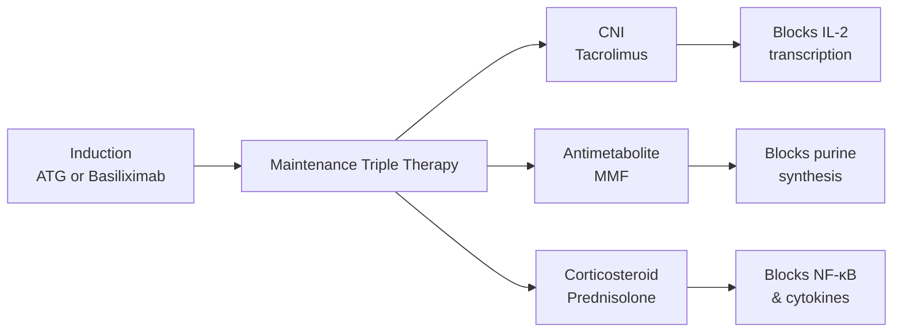

# Immunosuppressive Therapy

> *NucleuX Academy — Surgery > General Topics*
> *Sources: Sabiston 22nd Ed Ch.26, Rang & Dale 9th Ed Ch.25*

---

## 1. Introduction

**[UG]** **Immunosuppressive therapy** is essential for preventing **graft rejection** after organ transplantation. The goal is to suppress the host immune response against donor antigens while minimizing infection risk and drug toxicity. Modern protocols use **triple therapy** combining drugs with different mechanisms.

---

## 2. Phases of Immunosuppression

| Phase | Timing | Goal | Agents |
|-------|--------|------|--------|
| **Induction** | Peri-operative | Intense suppression | Anti-thymocyte globulin (ATG), Basiliximab |
| **Maintenance** | Lifelong | Prevent rejection | Tacrolimus + MMF + Steroids |
| **Rescue/Rejection** | Acute episodes | Reverse rejection | Pulse steroids, ATG, OKT3 |

---

## 3. Drug Classes

### Calcineurin Inhibitors (CNIs)
**[UG]** **Cyclosporine** and **Tacrolimus** — block **calcineurin** → inhibit IL-2 transcription → suppress T-cell activation.
- Tacrolimus is **100x more potent** than cyclosporine
- Major side effect: **nephrotoxicity** (both), diabetes (tacrolimus), gingival hyperplasia (cyclosporine)

### Antimetabolites
**[UG]** **Mycophenolate mofetil (MMF)** — inhibits **inosine monophosphate dehydrogenase (IMPDH)** → blocks purine synthesis → selectively inhibits lymphocytes
- **Azathioprine** — prodrug of 6-mercaptopurine, inhibits purine synthesis; older agent, less selective

### mTOR Inhibitors
**[PG]** **Sirolimus (Rapamycin)** and **Everolimus** — block **mTOR** → inhibit T-cell proliferation (G1→S phase arrest)
- Do NOT cause nephrotoxicity (useful in CNI-sparing protocols)
- Side effects: hyperlipidemia, poor wound healing, mouth ulcers

### Biologics
**[PG]** **Basiliximab** — anti-CD25 (anti-IL-2 receptor) monoclonal antibody → used for induction
**ATG** — polyclonal anti-T-cell antibody → profound lymphocyte depletion

---

## 4. Standard Triple Therapy

---

## 5. Important Drug Interactions

- **Azathioprine + Allopurinol** → Severe myelosuppression (allopurinol inhibits xanthine oxidase, needed for azathioprine metabolism)
- **Cyclosporine + Sirolimus** → Synergistic nephrotoxicity — avoid combination
- CNI levels affected by **CYP3A4** inducers/inhibitors

---

## 6. Clinical Relevance

Immunosuppression is a **lifelong commitment** for transplant recipients. The major long-term risks are **infections** (CMV, BK virus, Pneumocystis), **malignancy** (especially skin cancers and **PTLD — post-transplant lymphoproliferative disorder**, associated with EBV), and **cardiovascular disease**.
