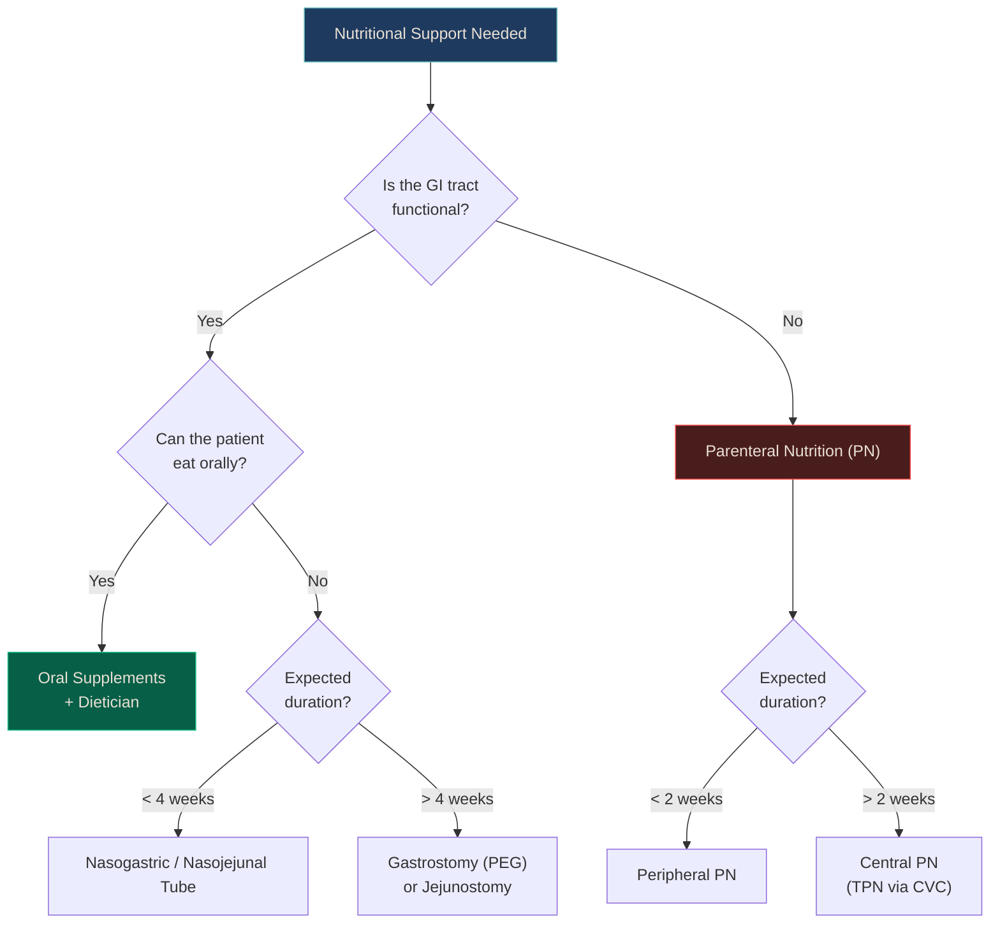

# Surgical Nutrition

> *NucleuX Academy — Surgery > General Topics*
> *Sources: Sabiston 22nd Ed Ch.5, Schwartz 11th Ed Ch.2*

---

## 1. Introduction

**[UG]** **Malnutrition** is present in 30–50% of hospitalized surgical patients and is independently associated with increased wound infections, anastomotic leaks, prolonged ICU stay, and mortality. Despite this, it remains under-recognized and under-treated. Every surgeon must be able to assess nutritional status, calculate requirements, and choose the appropriate route of feeding.^[Sabiston 22nd, Ch.5]

The fundamental principle: **"If the gut works, use it."** Enteral nutrition is always preferred over parenteral nutrition.

---

## 2. Nutritional Assessment

**[UG]** No single marker is definitive. A multimodal assessment is required:

### 2.1 Clinical Assessment

| Parameter | What to Look For |
|-----------|-----------------|
| **Weight loss** | >10% in 6 months or >5% in 1 month = significant |
| **BMI** | <18.5 = underweight; <16 = severe malnutrition |
| **Muscle wasting** | Temporal wasting, interosseous muscle loss, thenar atrophy |
| **Oedema** | Hypoalbuminaemia-related — may mask weight loss |
| **Functional status** | Grip strength (dynamometry) — best bedside functional test |

### 2.2 Biochemical Markers

| Marker | Half-life | Significance |
|--------|-----------|-------------|
| **Albumin** | 20 days | Chronic nutritional status; falls in acute illness (negative acute-phase protein) — NOT reliable acutely |
| **Pre-albumin (Transthyretin)** | 2 days | Best short-term marker; responsive to nutritional intervention |
| **Transferrin** | 8 days | Intermediate marker; affected by iron status |
| **Retinol-binding protein** | 12 hours | Ultra-short-term; rarely used clinically |
| **Total lymphocyte count** | — | <1500/μL suggests malnutrition-related immunosuppression |

<strong style="color: #FCA5A5;">High Yield:</strong> <strong>Albumin</strong> is a negative acute-phase protein — it falls in any inflammatory state (surgery, sepsis, trauma). A low albumin post-operatively reflects <strong>inflammation</strong>, not nutritional depletion. Use <strong>pre-albumin</strong> for short-term nutritional monitoring.

### 2.3 Screening Tools

| Tool | Components | Setting |
|------|-----------|---------|
| **NRS-2002** (Nutritional Risk Screening) | BMI, weight loss, food intake, disease severity | Hospitalized patients (ESPEN recommended) |
| **SGA** (Subjective Global Assessment) | History + physical exam | Gold standard for research |
| **MUST** (Malnutrition Universal Screening Tool) | BMI, weight loss, acute disease effect | Community + hospital |

---

## 3. Energy and Protein Requirements

**[UG]** Calculating nutritional needs:

| Parameter | Requirement | Notes |
|-----------|------------|-------|
| **Energy** | 25–30 kcal/kg/day | Adjust for stress level; burns may need 35–40 |
| **Protein** | 1.2–1.5 g/kg/day | Surgical patients need more than maintenance (0.8 g/kg) |
| **Nitrogen** | 1 g N₂ = 6.25 g protein | Used for nitrogen balance calculations |
| **Fluid** | 30–35 mL/kg/day | Baseline; adjust for losses |

**[PG]** The **Harris-Benedict equation** estimates basal energy expenditure (BEE):
- Men: `BEE = 66.5 + (13.75 × weight) + (5.003 × height) − (6.775 × age)`
- Women: `BEE = 655 + (9.563 × weight) + (1.85 × height) − (4.676 × age)`

Multiply by **stress factor** (1.2–1.5 for surgery, 1.5–2.0 for burns/sepsis) and **activity factor** (1.2 for bed-bound, 1.3 for ambulatory).

**[PG]** **Indirect calorimetry** (measuring O₂ consumption and CO₂ production) is the gold standard for determining actual energy expenditure in critically ill patients but is not widely available.

---

## 4. Routes of Nutritional Support

### 4.1 Enteral Nutrition (EN)

**[UG]** Advantages of enteral over parenteral nutrition:

| Feature | Enteral | Parenteral |
|---------|---------|-----------|
| **Gut barrier** | Maintained | Atrophies (bacterial translocation risk) |
| **Cost** | Low | 5–10× more expensive |
| **Infectious complications** | Lower | Higher (catheter-related bloodstream infection) |
| **Metabolic complications** | Fewer | Hyperglycaemia, liver dysfunction, refeeding |
| **Immune function** | Preserved (gut-associated lymphoid tissue) | Impaired |

**[UG]** Types of enteral feeds:

| Type | Composition | Indication |
|------|------------|------------|
| **Polymeric** | Intact protein, complex carbs, long-chain triglycerides | Normal gut function, most patients |
| **Semi-elemental** | Peptides, medium-chain triglycerides | Impaired absorption (short bowel, pancreatitis) |
| **Elemental** | Free amino acids, simple sugars | Severe malabsorption |
| **Disease-specific** | Modified for diabetes, renal failure, hepatic failure | Organ dysfunction |
| **Immunonutrition** | Supplemented with arginine, glutamine, omega-3, nucleotides | Perioperative (controversial) |

### 4.2 Parenteral Nutrition (PN)

**[PG]** Indications for TPN:
- Non-functional GI tract (ileus >7 days, short bowel, high-output fistula)
- Inability to meet >60% caloric needs via EN
- Severe malabsorption

**[PG]** Components of a standard TPN bag:

| Component | Content | Notes |
|-----------|---------|-------|
| **Amino acids** | 1.2–1.5 g/kg/day | Protein source |
| **Dextrose** | 3–5 mg/kg/min (max) | Primary calorie source; monitor glucose |
| **Lipid emulsion** | 20–30% of total calories | Intralipid (soybean); avoid in hypertriglyceridaemia |
| **Electrolytes** | Na⁺, K⁺, Ca²⁺, Mg²⁺, PO₄³⁻ | Daily monitoring initially |
| **Vitamins** | MVI (multivitamin injection) | Water and fat-soluble |
| **Trace elements** | Zn, Cu, Se, Mn, Cr | Essential for wound healing and immunity |

<strong style="color: #FCD34D;">Warning:</strong> <strong>Refeeding syndrome</strong> is a life-threatening complication of starting nutrition in severely malnourished patients. Rapid carbohydrate loading drives insulin secretion, which causes massive intracellular shift of <strong>phosphate, potassium, and magnesium</strong>. Hallmark: <strong>hypophosphataemia</strong>. Prevent by starting feeds at 50% of estimated needs and supplementing phosphate, K⁺, and Mg²⁺.

---

## 5. Refeeding Syndrome

**[UG]** **Refeeding syndrome** is the most dangerous nutritional complication:

| Feature | Detail |
|---------|--------|
| **Mechanism** | Insulin surge → intracellular shift of PO₄³⁻, K⁺, Mg²⁺ |
| **Hallmark** | Severe **hypophosphataemia** (<0.5 mmol/L) |
| **Risk factors** | BMI <16, >10% weight loss in 3–6 months, little intake for >5 days |
| **Complications** | Cardiac arrhythmias, heart failure, respiratory failure, rhabdomyolysis, seizures |
| **Prevention** | Start low (10–20 kcal/kg/day), advance slowly, supplement PO₄³⁻/K⁺/Mg²⁺/thiamine |
| **Thiamine** | Give **before** starting feeds — prevents Wernicke's encephalopathy |

---

## 6. Fluid and Electrolyte Replacement

**[UG]** Daily maintenance requirements:

| Component | Adult Requirement |
|-----------|------------------|
| **Water** | 30–35 mL/kg/day (or 1500 mL + 20 mL per kg above 20 kg) |
| **Sodium** | 1–2 mmol/kg/day |
| **Potassium** | 1 mmol/kg/day |
| **Glucose** | 50–100 g/day (prevents ketosis) |

**[UG]** Common IV fluids:

| Fluid | Na⁺ | K⁺ | Cl⁻ | Osmolarity | Use |
|-------|-----|-----|-----|-----------|-----|
| **Normal Saline (0.9%)** | 154 | 0 | 154 | 308 | Resuscitation, hyponatraemia |
| **Ringer's Lactate** | 130 | 4 | 109 | 273 | Resuscitation (more physiological) |
| **5% Dextrose** | 0 | 0 | 0 | 278 | Free water replacement |
| **DNS (Dextrose + NS)** | 154 | 0 | 154 | 586 | Maintenance |

<strong style="color: #6EE7B7;">Clinical Pearl:</strong> <strong>Ringer's Lactate</strong> is more physiological than Normal Saline for resuscitation. Large-volume NS causes <strong>hyperchloraemic metabolic acidosis</strong> (dilutional — excess Cl⁻ relative to bicarbonate). The SMART trial (2018) showed balanced crystalloids reduced major adverse kidney events compared to saline.

---

## 7. Special Considerations

### 7.1 Immunonutrition

**[PG]** Supplementation with specific nutrients to modulate immune function:

| Nutrient | Mechanism | Evidence |
|----------|-----------|---------|
| **Arginine** | NO synthesis, T-cell function | May benefit elective surgery; avoid in sepsis |
| **Glutamine** | Enterocyte fuel, gut barrier integrity | Controversial — REDOXS trial showed harm in ICU |
| **Omega-3 fatty acids** | Anti-inflammatory (↓ PGE2) | Mixed evidence; some benefit in cancer surgery |
| **Nucleotides** | DNA/RNA synthesis for immune cells | Limited evidence |

### 7.2 Nutrition in Specific Surgical Conditions

| Condition | Key Nutritional Consideration |
|-----------|------------------------------|
| **Short bowel syndrome** | Gradual transition from TPN to EN; MCT-based feeds |
| **Enterocutaneous fistula** | Low-output: feed distally; high-output: TPN |
| **Acute pancreatitis** | EN preferred (nasojejunal); TPN only if EN fails |
| **Burns** | Highest caloric needs (Curreri formula); high protein |
| **Cancer** | Preoperative immunonutrition for 5–7 days if malnourished |

<strong style="color: #FCA5A5;">[SS]</strong> The <strong>REDOXS trial (2013)</strong> showed that glutamine supplementation in critically ill patients with organ failure actually <strong>increased mortality</strong>. This overturned decades of enthusiasm for glutamine in ICU nutrition. Current guidelines (ESPEN 2019) recommend against routine glutamine supplementation in critically ill patients with organ failure — though it may still benefit elective surgical patients without organ dysfunction.

---

## 8. Key Points Summary

**[UG] — Must-Know:**
- 30–50% of surgical patients are malnourished at admission
- Pre-albumin (t½ 2 days) is the best short-term nutritional marker
- "If the gut works, use it" — enteral > parenteral always
- Energy: 25–30 kcal/kg/day; Protein: 1.2–1.5 g/kg/day
- Refeeding syndrome hallmark: hypophosphataemia — start feeds slowly, give thiamine first
- Ringer's Lactate is preferred over NS for large-volume resuscitation

**[PG] — High-Yield:**
- NRS-2002 is the ESPEN-recommended screening tool for hospitalized patients
- TPN complications: catheter sepsis, hyperglycaemia, liver steatosis, refeeding syndrome
- Harris-Benedict equation estimates BEE; multiply by stress and activity factors
- Indirect calorimetry is the gold standard for energy expenditure measurement

**[SS] — Pearls:**
- REDOXS trial: glutamine may harm ICU patients with organ failure
- SMART trial: balanced crystalloids > saline for kidney outcomes
- Immunonutrition with arginine is beneficial preoperatively but potentially harmful in sepsis

---

<strong style="color: #A78BFA;">References:</strong> 
• Sabiston Textbook of Surgery, 22nd Ed, Ch.5 (p.98-120) 
• Schwartz's Principles of Surgery, 11th Ed, Ch.2 
• ESPEN Guidelines on Clinical Nutrition in Surgery (2017) 
• NICE-SUGAR Study. NEJM 2009;360:1283-97

---

> *NucleuX Academy — Where Knowledge Condenses*
