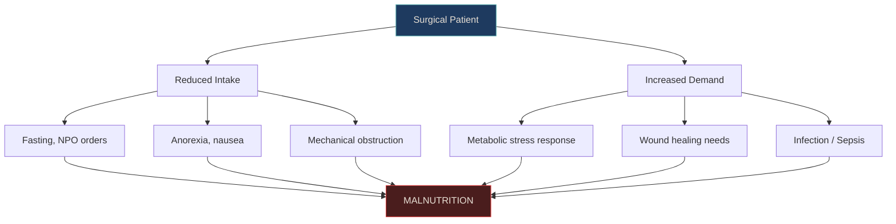
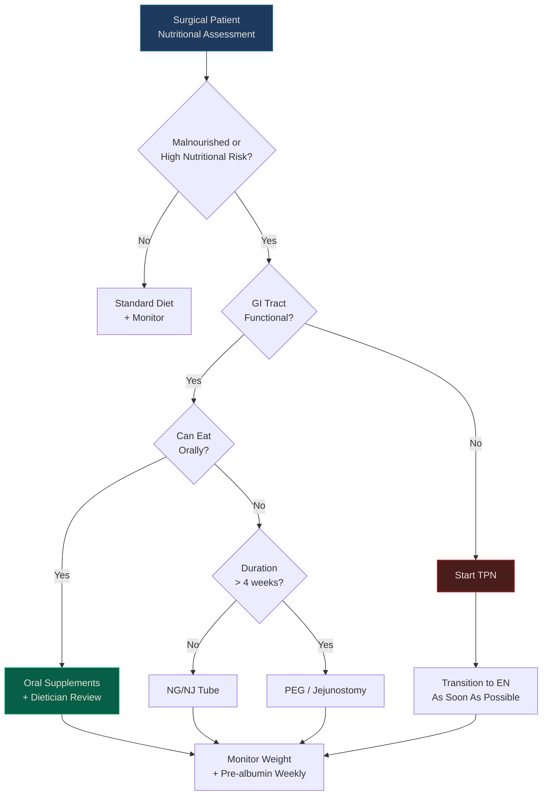

# Chapter: Surgical Nutrition

> *NucleuX Originals — Surgery Series*
> *Written by ATOM · Faculty Reviewed*

---

**Depth Key:** **[UG]** Undergraduate Essential · **[PG]** Postgraduate Depth · **[SS]** Superspecialty Pearl

---

## 1. History — Feeding the Wounded

**[UG]** The importance of nutrition in surgical recovery was recognized empirically for centuries, but the science began in earnest in the 20th century. **Jonathan Rhoads** at the University of Pennsylvania developed the first practical **total parenteral nutrition (TPN)** system in 1968, demonstrating that patients could survive entirely on intravenous nutrition when the gut was non-functional.^[Sabiston 22nd, Ch.5]

**Stanley Dudrick**, Rhoads' trainee, showed that beagle puppies could grow and develop normally on TPN alone — proving that IV nutrition could sustain life, not merely stave off death. This revolutionized the management of short bowel syndrome, high-output fistulae, and prolonged ileus.

| Year | Milestone |
|------|-----------|
| 1936 | **Studley** — First to link preoperative weight loss to surgical mortality |
| 1968 | **Rhoads & Dudrick** — TPN developed at University of Pennsylvania |
| 1979 | **Gauderer & Ponsky** — Percutaneous endoscopic gastrostomy (PEG) |
| 2003 | **NRS-2002** adopted by ESPEN for nutritional risk screening |
| 2013 | **REDOXS trial** — Glutamine supplementation harmful in organ failure |
| 2017 | **ESPEN guidelines** on clinical nutrition in surgery |

<strong style="color: #A78BFA;">References:</strong> 
• Sabiston Textbook of Surgery, 22nd Ed, Ch.5 (p.98-100) 
• Dudrick SJ et al. Surgery 1968;64:134-142

---

## 2. Pathophysiology — Why Surgical Patients Become Malnourished

**[UG]** Surgical patients face a **dual insult** to nutritional status:

1. **Reduced intake** — fasting, anorexia, nausea, ileus, dysphagia, bowel obstruction
2. **Increased demand** — the metabolic response to surgery (catabolism, hypermetabolism) accelerates nutrient utilization

**[PG]** The consequences of surgical malnutrition are far-reaching:

| Consequence | Mechanism |
|------------|-----------|
| **Impaired wound healing** | Deficient collagen synthesis (needs protein + vitamin C + zinc) |
| **Anastomotic leak** | Weak collagen cross-linking at anastomotic site |
| **Immunosuppression** | ↓ Lymphocytes, ↓ complement, impaired phagocytosis |
| **Increased infections** | SSI, pneumonia, UTI — all more common |
| **Prolonged ventilation** | Respiratory muscle wasting → difficult weaning |
| **Pressure sores** | Tissue vulnerability from protein depletion |

---

## 3. Clinical Presentation — Recognizing Malnutrition

**[UG]** The clinical examination systematically assesses:

| Sign | Deficiency |
|------|-----------|
| **Temporal wasting** | Overall protein-calorie malnutrition |
| **Pedal oedema** (non-cardiac) | Hypoalbuminaemia |
| **Angular stomatitis, glossitis** | B-vitamin deficiency (B2, B3, B12) |
| **Poor wound healing** | Protein, vitamin C, zinc deficiency |
| **Koilonychia** | Iron deficiency |
| **Night blindness** | Vitamin A deficiency |
| **Bleeding tendency** | Vitamin K deficiency (especially with biliary obstruction) |

**[PG]** **Marasmus** (calorie deficiency — wasted but alert) vs **Kwashiorkor** (protein deficiency — oedematous, apathetic):

| Feature | Marasmus | Kwashiorkor |
|---------|----------|-------------|
| Cause | Total calorie deficiency | Protein deficiency (relative) |
| Appearance | Wasted, skin and bones | Oedematous, moon face |
| Albumin | Low-normal | Very low (<2.0 g/dL) |
| Oedema | Absent | Present (pitting) |
| Fat stores | Depleted | May be preserved |
| Immune function | Impaired | Severely impaired |
| Surgical relevance | Chronic disease, cancer cachexia | Acute illness superimposed on inadequate diet |

---

## 4. Diagnosis & Investigations

**[UG]** Nutritional assessment is a clinical diagnosis supported by biochemistry:

### Screening Tools

| Tool | Best For | Key Feature |
|------|---------|-------------|
| **NRS-2002** | Hospital inpatients | ESPEN recommended; includes disease severity |
| **SGA** | Research gold standard | History-based + physical exam |
| **MUST** | Community + hospital | Quick; 3 components (BMI, weight loss, acute disease) |

### Biochemical Assessment

**[UG]** Pre-albumin is the most useful short-term marker:

| Marker | Normal | Mild | Moderate | Severe |
|--------|--------|------|----------|--------|
| **Albumin (g/dL)** | 3.5–5.0 | 3.0–3.5 | 2.5–3.0 | <2.5 |
| **Pre-albumin (mg/dL)** | 20–40 | 15–20 | 10–15 | <10 |
| **Transferrin (mg/dL)** | 200–400 | 150–200 | 100–150 | <100 |
| **TLC (/μL)** | >2000 | 1200–2000 | 800–1200 | <800 |

### Nitrogen Balance

**[PG]** Nitrogen balance = Nitrogen intake − Nitrogen output

`N₂ balance = (Protein intake ÷ 6.25) − (24h urinary urea nitrogen + 4)`

The "+4" accounts for insensible nitrogen losses (skin, stool, other). A positive balance indicates anabolism; negative indicates catabolism.

---

## 5. Management

### 5.1 Enteral Nutrition

**[UG]** The golden rule: **"If the gut works, use it."**

Enteral nutrition maintains the gut mucosal barrier, prevents bacterial translocation, preserves gut-associated lymphoid tissue (GALT), and is safer and cheaper than parenteral nutrition.

**Access routes:**

| Route | Indication | Duration |
|-------|-----------|----------|
| **Nasogastric tube (NGT)** | Functional stomach, intact gag | <4 weeks |
| **Nasojejunal tube (NJT)** | Gastroparesis, pancreatitis, post-pyloric feeding needed | <4 weeks |
| **PEG** | Long-term enteral access, functional stomach | >4 weeks |
| **Surgical jejunostomy** | Post-oesophagectomy/gastrectomy, long-term | >4 weeks |

### 5.2 Parenteral Nutrition

**[PG]** Reserved for patients where EN is impossible or insufficient:

**Indications:**
- Complete bowel obstruction
- High-output enterocutaneous fistula (>500 mL/day)
- Severe short bowel syndrome (initial phase)
- Prolonged ileus (>7 days)
- Inability to meet >60% needs via EN

**Complications of TPN:**

| Category | Complication | Prevention/Management |
|----------|-------------|----------------------|
| **Catheter** | CRBSI (catheter-related bloodstream infection) | Aseptic technique, chlorhexidine, line care bundles |
| **Metabolic** | Hyperglycaemia | Insulin protocol; target 140–180 mg/dL |
| **Metabolic** | Hypertriglyceridaemia | Monitor triglycerides; hold lipids if >400 mg/dL |
| **Hepatic** | TPN-associated liver disease (steatosis → cholestasis) | Cycle TPN (not 24h continuous), add EN as able |
| **Metabolic** | Refeeding syndrome | Start low, advance slowly, supplement PO₄/K⁺/Mg²⁺/thiamine |
| **Electrolyte** | Hypo/hypernatraemia, hypokalaemia | Daily electrolyte monitoring |

### 5.3 Management Algorithm

---

## 6. Fluid and Electrolyte Management

**[UG]** Perioperative fluid therapy follows the principle of **replacement** (deficit + maintenance + ongoing losses):

| Component | Calculation |
|-----------|------------|
| **Maintenance** | 4-2-1 rule: 4 mL/kg/h (first 10 kg) + 2 mL/kg/h (next 10 kg) + 1 mL/kg/h (each kg above 20) |
| **Deficit** | Hours NPO × maintenance rate |
| **Third-space losses** | 4–8 mL/kg/h (major abdominal surgery) |
| **Blood loss** | Replace with crystalloid 3:1 or colloid 1:1 |

**[PG]** Goal-directed fluid therapy (GDFT) using stroke volume optimization (oesophageal Doppler, arterial waveform analysis) reduces complications compared to fixed-protocol fluid management.^[Sabiston 22nd, Ch.5]

<strong style="color: #FCA5A5;">[SS]</strong> The <strong>"restrictive" vs "liberal"</strong> fluid debate in surgery has nuance. The RELIEF trial (2018) showed restrictive fluids increased acute kidney injury without reducing disability-free survival. Current consensus favors <strong>goal-directed</strong> rather than either extreme — "just right" fluid therapy guided by physiological endpoints, not arbitrary volume targets.

---

## 7. Complications

| Complication | Setting | Key Feature | Management |
|-------------|---------|-------------|------------|
| **Refeeding syndrome** | Starting feeds in malnourished | Hypophosphataemia | Start low, supplement PO₄/K⁺/Mg²⁺, thiamine |
| **Aspiration** | NGT/oral feeding | Pneumonia | Head elevation 30°, post-pyloric feeding |
| **CRBSI** | TPN via central line | Fever + positive blood cultures | Remove line, antibiotics |
| **TPN liver disease** | Prolonged TPN | Steatosis → cholestasis | Cycle TPN, transition to EN |
| **Hyperglycaemia** | TPN (dextrose load) | ↑ Infection risk | Insulin; reduce dextrose rate |
| **Tube displacement** | Enteral feeding | Feed into peritoneum/lung | Confirm position before use |

---

## 8. Key Points

**[UG] — Must-Know:**
- 30–50% of surgical patients are malnourished; screen all admissions
- Pre-albumin (t½ 2 days) is the best short-term nutritional marker
- Enteral nutrition is always preferred over parenteral — preserves gut barrier
- Energy: 25–30 kcal/kg/day; Protein: 1.2–1.5 g/kg/day
- Refeeding syndrome: hypophosphataemia is the hallmark; give thiamine first
- 4-2-1 rule for maintenance fluid calculation
- RL is preferred over NS for resuscitation (less hyperchloraemic acidosis)

**[PG] — High-Yield:**
- NRS-2002 (ESPEN) for hospital screening; SGA for research
- TPN indications: non-functional gut, high-output fistula, severe short bowel
- TPN liver disease: cycle TPN, transition to EN early
- Harris-Benedict equation for BEE; indirect calorimetry is gold standard
- Nitrogen balance guides protein adequacy in ICU patients

**[SS] — Pearls:**
- REDOXS trial: glutamine harms ICU patients with organ failure
- RELIEF trial: restrictive fluids increase AKI — favor goal-directed therapy
- Immunonutrition (arginine) benefits elective surgery but may worsen sepsis

---

## References & Further Reading

<strong style="color: #A78BFA;">Primary Sources:</strong> 
• Sabiston Textbook of Surgery, 22nd Ed, Ch.5 — Surgical Nutrition (p.98-120) 
• Schwartz's Principles of Surgery, 11th Ed, Ch.2  
<strong style="color: #A78BFA;">Supplementary:</strong> 
• Bailey & Love's Short Practice of Surgery, 28th Ed, Ch.19 
• ESPEN Guidelines on Clinical Nutrition in Surgery (Weimann et al., 2017)  
<strong style="color: #A78BFA;">Landmark Trials:</strong> 
• REDOXS Trial. NEJM 2013;368:1489-97 (Glutamine in critical illness) 
• SMART Trial. NEJM 2018;378:829-39 (Balanced crystalloids vs saline) 
• RELIEF Trial. NEJM 2018;378:2263-74 (Restrictive vs liberal fluids)

---

> *NucleuX Academy — Where Knowledge Condenses*
