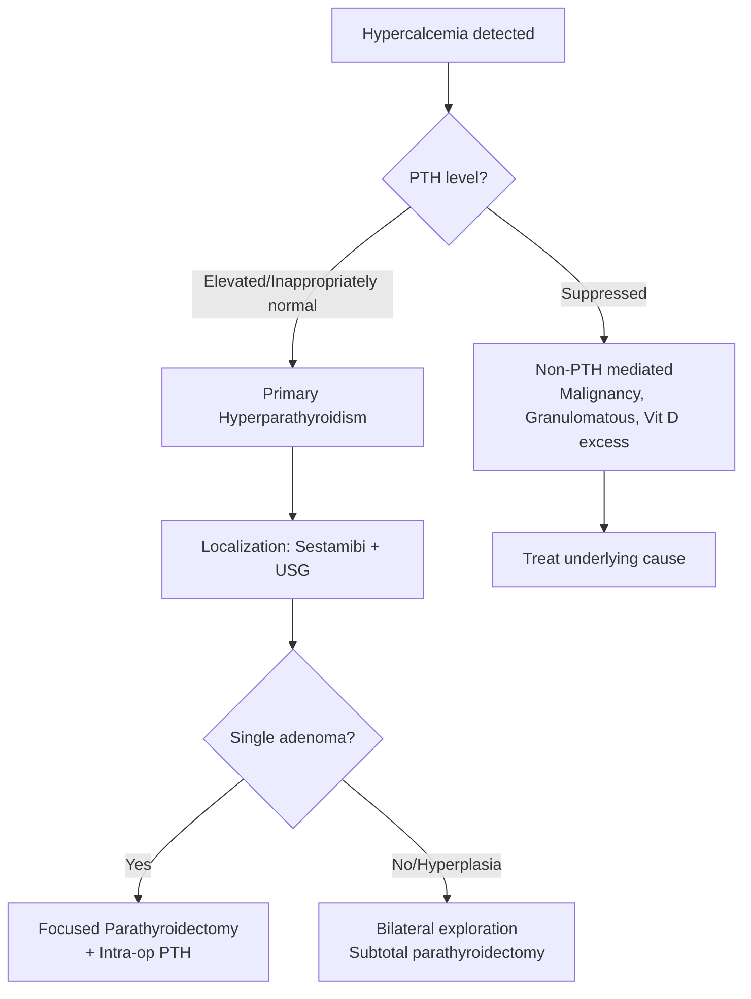

# Parathyroid Disorders

> *NucleuX Academy — Surgery > Head & Neck*
> *Sources: Sabiston 22nd Ed Ch.38, Bailey & Love 28th Ed Ch.51*

---

## 1. Introduction

**[UG]** The **parathyroid glands** (usually 4) regulate **calcium homeostasis** via **parathyroid hormone (PTH)**. PTH increases serum calcium by: (1) osteoclast activation (bone resorption), (2) renal calcium reabsorption + phosphate excretion, (3) stimulating renal 1α-hydroxylase → active vitamin D (1,25-dihydroxycholecalciferol).

---

## 2. Hyperparathyroidism — Classification

| Type | Cause | Calcium | PTH | Phosphate |
|------|-------|---------|-----|-----------|
| **Primary** | Adenoma (85%), Hyperplasia (10%), Carcinoma (<5%) | ↑ | ↑ | ↓ |
| **Secondary** | CKD (most common), Vitamin D deficiency | ↓ or Normal | ↑↑ | ↑ (CKD) |
| **Tertiary** | Autonomous hyperplasia after prolonged secondary | ↑ | ↑↑↑ | Variable |

---

## 3. Clinical Features of Primary Hyperparathyroidism

**[UG]** Classic presentation: **"Bones, Stones, Abdominal Groans, and Psychic Moans"**
- **Bones**: Osteitis fibrosa cystica, **brown tumours**, subperiosteal resorption (radial side of middle phalanx), **salt and pepper skull**
- **Stones**: Renal calculi (calcium oxalate/phosphate)
- **Abdominal groans**: Constipation, peptic ulcer, pancreatitis
- **Psychic moans**: Depression, confusion, fatigue

Most patients today are **asymptomatic** — detected incidentally on routine blood work (hypercalcemia).

---

## 4. Diagnosis & Localization

**[UG]** **Diagnosis**: Elevated calcium + elevated/inappropriately normal PTH

**Localization** (pre-operative):
- **Sestamibi scan (⁹⁹mTc-MIBI)**: Most sensitive single modality — adenoma shows delayed washout
- **Neck ultrasound**: Operator-dependent, detects 70-80%
- **4D-CT**: Superior anatomical detail, especially for re-operations

---

## 5. Management

**[PG]** **Surgery** is the only cure for primary hyperparathyroidism:
- **Single adenoma** (85%): **Focused/minimally invasive parathyroidectomy** (MIP)
- **Hyperplasia** (MEN syndromes): **Subtotal parathyroidectomy** (3.5 glands) or total + autotransplant (forearm)
- **Intra-operative PTH monitoring** (Miami criterion): PTH drop >50% from pre-excision baseline at 10 min confirms cure

**Indications for surgery in asymptomatic primary HPT:**
- Age <50, Ca >1 mg/dL above normal, CrCl <60, T-score <-2.5, renal stones

---

## 6. Diagnostic Flowchart

---

## 7. Clinical Relevance

**Hungry bone syndrome** occurs after parathyroidectomy — rapid calcium/phosphate uptake by bones → severe **hypocalcemia**. Monitor calcium closely and supplement aggressively. **Parathyroid carcinoma** is rare (<5%) — suspect if Ca >14 mg/dL, palpable neck mass, or very high PTH. Treatment is **en bloc resection**.
