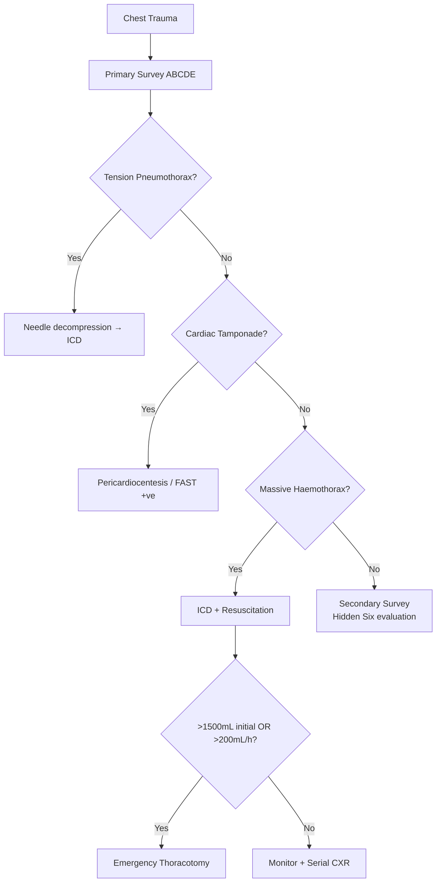

# Chest Trauma

> *NucleuX Academy — Surgery > General Topics*
> *Sources: Sabiston 22nd Ed Ch.19, ATLS 10th Ed Ch.4, Bailey & Love 28th Ed Ch.28*

---

## 1. Introduction

**[PG]** **Chest trauma** accounts for ~25% of trauma deaths. Most life-threatening thoracic injuries can be managed with **tube thoracostomy** (chest drain) — only ~15% require thoracotomy. The key is rapid identification during the **primary survey**.

---

## 2. Immediately Life-Threatening Injuries (Primary Survey)

**[UG]** The **"Lethal Six"** (identified and treated during primary survey):

| Condition | Pathology | Clinical Signs | Immediate Treatment |
|-----------|-----------|----------------|-------------------|
| **Tension pneumothorax** | One-way valve air leak | Tracheal deviation, absent breath sounds, hypotension, distended neck veins | **Needle decompression** (2nd ICS MCL) → chest drain |
| **Open pneumothorax** | Sucking chest wound (>⅔ tracheal diameter) | Air entry through wound | **Three-sided dressing** → chest drain |
| **Massive haemothorax** | >1500 mL blood in pleura | Dull percussion, hypotension | **Chest drain + Fluid resuscitation** ± thoracotomy |
| **Cardiac tamponade** | Blood in pericardium | **Beck's triad**: muffled heart sounds, hypotension, distended neck veins | **Pericardiocentesis** (subxiphoid) |
| **Flail chest** | ≥3 consecutive ribs fractured in ≥2 places | **Paradoxical respiration** | Analgesia + ventilatory support |
| **Airway obstruction** | Laryngeal/tracheal injury | Stridor, subcutaneous emphysema | Secure airway (intubation/surgical) |

---

## 3. Potentially Lethal Injuries (Secondary Survey)

**[PG]** The **"Hidden Six":**
- **Aortic disruption** — widened mediastinum on CXR, CT angiography diagnostic
- **Tracheobronchial injury** — persistent air leak after chest drain
- **Oesophageal injury** — left pleural effusion without rib fracture, pneumomediastinum
- **Diaphragmatic rupture** — **left side** more common (80%), bowel in chest on CXR
- **Pulmonary contusion** — most common potentially lethal injury, patchy opacities on CXR
- **Blunt cardiac injury** — ECG changes, troponin elevation

---

## 4. Chest Drain Placement

**Safe triangle**: Anterior border of latissimus dorsi, lateral border of pectoralis major, 5th intercostal space, apex of axilla. Insert **above the rib** (neurovascular bundle runs below).

---

## 5. Decision Flowchart

---

## 6. Clinical Relevance

**Tension pneumothorax** is a **clinical diagnosis** — do NOT wait for CXR. **FAST (eFAST)** in the trauma bay detects pericardial effusion and pneumo/haemothorax rapidly. The **indications for thoracotomy** include: >1500 mL initial drainage, >200 mL/h for 2-4 hours, cardiac tamponade not responding to pericardiocentesis, and great vessel injury.
