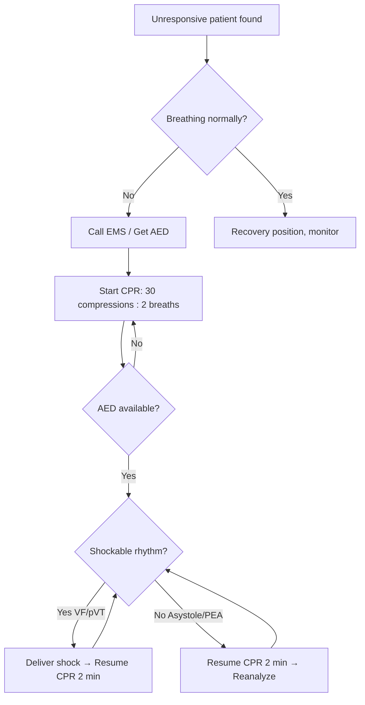

# First Aid & Basic Life Support

> *NucleuX Academy — Surgery > General Topics*
> *Sources: Sabiston 22nd Ed Ch.18, AHA BLS/ACLS Guidelines 2020*

---

## 1. Introduction

**[PG]** **Basic Life Support (BLS)** is the foundation of emergency care — a systematic approach to recognizing cardiac arrest and maintaining circulation and breathing until advanced help arrives. **First aid** encompasses the immediate care given to an injured or ill person before professional medical treatment.

---

## 2. Chain of Survival

The **AHA Chain of Survival** has 6 links:
1. **Early recognition** and activation of EMS
2. **Early CPR** — high-quality chest compressions
3. **Early defibrillation** — AED within 3-5 min
4. **Advanced Life Support**
5. **Post-cardiac arrest care**
6. **Recovery**

---

## 3. BLS Algorithm (Adult)

**[UG]** Key parameters:
- **Compression rate**: 100-120/min
- **Compression depth**: 5-6 cm (2-2.4 inches)
- **Compression-ventilation ratio**: **30:2** (1 or 2 rescuers in adults)
- **Allow full chest recoil** between compressions
- **Minimize interruptions** (<10 seconds)

**[UG]** **CAB sequence** (Circulation → Airway → Breathing) replaced ABC since 2010 guidelines.

---

## 4. Airway Management

**[UG]** Basic manoeuvres:
- **Head-tilt chin-lift** (no trauma)
- **Jaw thrust** (suspected cervical spine injury)
- **Recovery position** for unconscious breathing patient

**Adjuncts**: Oropharyngeal airway (Guedel), Nasopharyngeal airway

---

## 5. Triage

**[PG]** **Triage** prioritizes patients in mass casualty incidents. The **START system** (Simple Triage and Rapid Treatment):

| Category | Color | Criteria |
|----------|-------|----------|
| Immediate | 🔴 Red | Life-threatening, salvageable |
| Delayed | 🟡 Yellow | Serious but can wait |
| Minor | 🟢 Green | Walking wounded |
| Deceased | ⚫ Black | Dead or non-salvageable |

---

## 6. Key Clinical Concepts

- **Choking (conscious adult)**: **Heimlich manoeuvre** (abdominal thrusts)
- **Choking (infant)**: 5 back blows + 5 chest thrusts
- **AED**: Analyze rhythm → shock if VF/pulseless VT → resume CPR immediately
- **Shockable rhythms**: **VF** and **pulseless VT**
- **Non-shockable**: Asystole, PEA

---

## 7. BLS Decision Flowchart

---

## 8. Clinical Relevance

BLS skills are **mandatory competencies** for all healthcare professionals. Early CPR **doubles or triples** survival from out-of-hospital cardiac arrest. Every minute without defibrillation decreases survival by **7-10%**.
