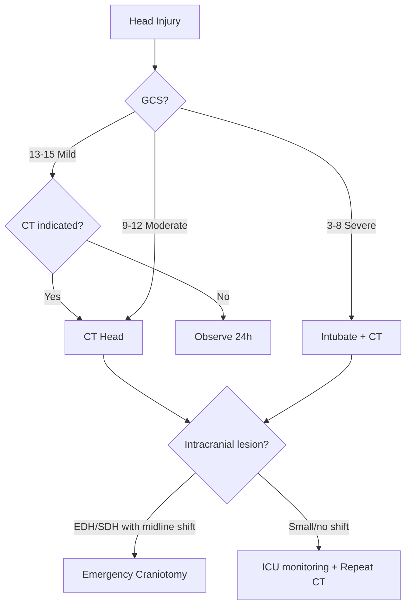

# Head Injury

> *NucleuX Academy — Surgery > General Topics*
> *Sources: Sabiston 22nd Ed Ch.19, Bailey & Love 28th Ed Ch.26*

---

## 1. Introduction

**[UG]** **Traumatic brain injury (TBI)** is a leading cause of death and disability in young adults. The key principle is preventing **secondary brain injury** (hypoxia, hypotension, raised ICP) after the initial **primary injury** which is irreversible.

---

## 2. Classification

**By GCS (Glasgow Coma Scale):**
| Severity | GCS | Management |
|----------|-----|------------|
| Mild | 13-15 | Observation ± CT |
| Moderate | 9-12 | CT + admission + monitoring |
| Severe | 3-8 | Intubation + ICU + ICP monitoring |

**GCS Components:** Eye (1-4) + Verbal (1-5) + Motor (1-6) = 3-15

---

## 3. Types of Intracranial Haemorrhage

| Type | Source | CT Appearance | Key Feature |
|------|--------|---------------|-------------|
| **Extradural (EDH)** | **Middle meningeal artery** | Biconvex/lenticular, hyperdense | **Lucid interval**, does NOT cross sutures |
| **Subdural (SDH)** | **Bridging veins** | Crescent-shaped | Crosses sutures, common in elderly/alcoholics |
| **Subarachnoid (SAH)** | Cerebral arteries | Blood in sulci/cisterns | Thunderclap headache |
| **Intracerebral** | Parenchymal vessels | Within brain substance | Contusion, contrecoup |

---

## 4. Management Principles

**[UG]** Primary survey (**ABCDE**) first. Key targets:
- **SBP > 90 mmHg** (avoid hypotension — single episode doubles mortality)
- **PaO₂ > 60 mmHg** (avoid hypoxia)
- **ICP < 20 mmHg**, **CPP > 60 mmHg** (CPP = MAP − ICP)

**ICP management:**
- Head elevation 30°, avoid jugular compression
- **Mannitol** 20% (0.25-1 g/kg) or **Hypertonic saline** 3%
- Hyperventilation (target PaCO₂ 30-35 mmHg) — only short-term
- **Decompressive craniectomy** in refractory raised ICP

---

## 5. Indications for Surgery

- **EDH** >30 mL or >15 mm thickness or midline shift >5 mm
- **Acute SDH** >10 mm thickness or midline shift >5 mm
- **Depressed skull fracture** deeper than the thickness of the skull
- **Open/compound fractures**

---

## 6. Decision Flowchart

---

## 7. Clinical Relevance

**Battle's sign** (mastoid ecchymosis) and **Raccoon eyes** (periorbital ecchymosis) indicate **base of skull fracture**. **CSF rhinorrhoea/otorrhoea** confirms the diagnosis. Never pack the nose/ear — risk of ascending infection.
