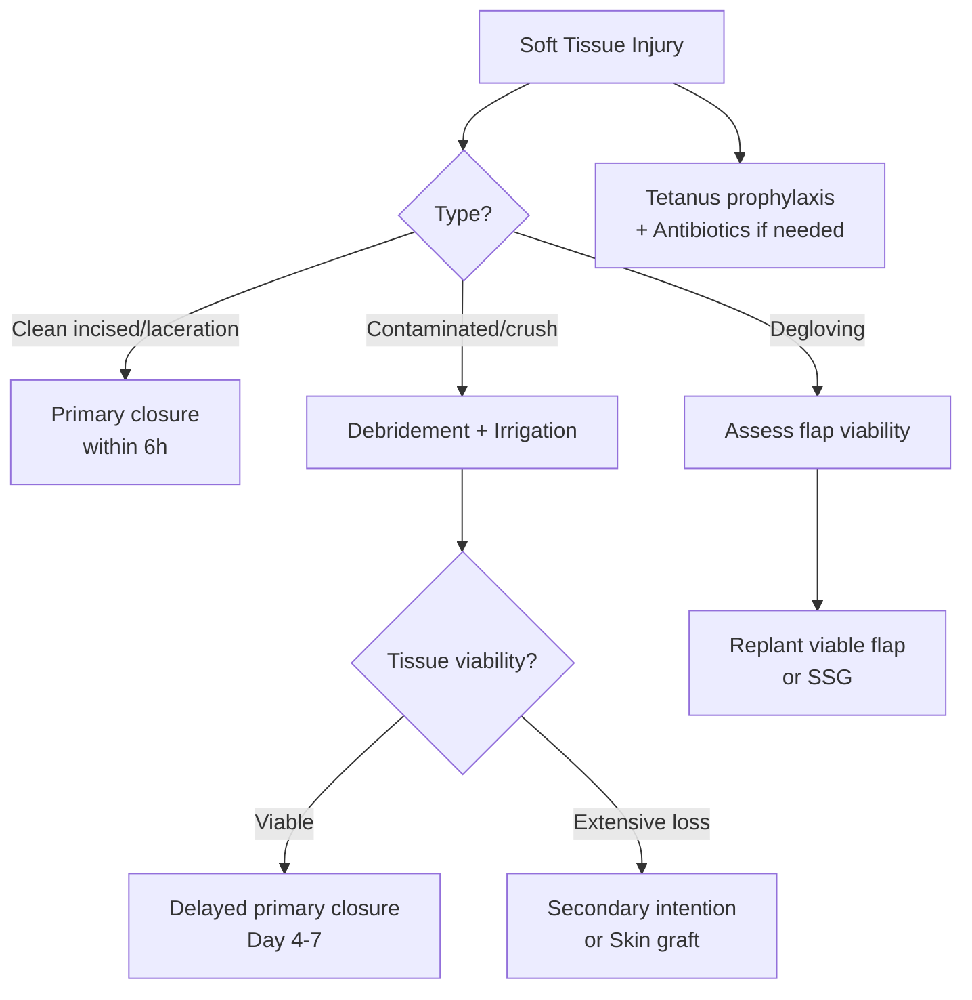

# Soft Tissue Injuries

> *NucleuX Academy — Surgery > General Topics*
> *Sources: Sabiston 22nd Ed Ch.18, Bailey & Love 28th Ed Ch.27*

---

## 1. Introduction

**[PG]** **Soft tissue injuries** encompass damage to skin, subcutaneous tissue, muscle, tendons, and blood vessels. Proper classification and timely management prevents complications like infection, compartment syndrome, and functional loss.

---

## 2. Classification of Wounds

| Type | Mechanism | Features |
|------|-----------|----------|
| **Incised wound** | Sharp object | Clean edges, bleeds freely |
| **Laceration** | Blunt force/tearing | Irregular, ragged edges, bridging tissue |
| **Contusion (bruise)** | Blunt trauma | Intact skin, subcutaneous bleeding |
| **Abrasion** | Friction/scraping | Superficial, involves epidermis |
| **Puncture** | Penetrating object | Small entry, deep track, high infection risk |
| **Crush injury** | Compressive force | Extensive deep damage, **rhabdomyolysis** risk |
| **Degloving** | Shearing force | Skin avulsed from underlying tissue |

---

## 3. Crush Injury & Crush Syndrome

**[UG]** **Crush syndrome** occurs when compressed muscle is released, causing:
- **Rhabdomyolysis** → myoglobin release → **acute kidney injury**
- **Hyperkalaemia** → cardiac arrest risk
- **DIC**, metabolic acidosis, hypovolaemic shock

**Management**: Aggressive **IV fluids** (NS) BEFORE releasing compression, alkalinize urine (NaHCO₃), treat hyperkalaemia, monitor for **compartment syndrome**.

---

## 4. Compartment Syndrome

**[UG]** Increased pressure within a closed fascial compartment → compromised tissue perfusion.
- **Most common site**: Anterior compartment of leg
- **Clinical**: Pain out of proportion, **pain on passive stretch** (earliest sign), paraesthesia, pulselessness (late)
- **Diagnosis**: Compartment pressure >30 mmHg or within 30 mmHg of diastolic
- **Treatment**: Emergency **fasciotomy**

---

## 5. Wound Management Principles

- **Golden period**: Wounds closed primarily within **6 hours** (face: up to 24h due to rich blood supply)
- **Tetanus prophylaxis**: Always assess status
- **Debridement**: Remove devitalized tissue, foreign bodies
- **Primary closure**: Clean wounds <6h old
- **Delayed primary closure**: Contaminated wounds, closed at 4-7 days
- **Secondary intention**: Heavily contaminated, large tissue loss

---

## 6. Management Flowchart

---

## 7. Clinical Relevance

Always assess for **neurovascular injury** in deep wounds. **Compartment syndrome** is a surgical emergency — delay causes irreversible **Volkmann's ischaemic contracture** (forearm) or tissue necrosis. The **6 Ps** (Pain, Pressure, Paraesthesia, Paralysis, Pallor, Pulselessness) are classic but late signs — don't wait for all.
