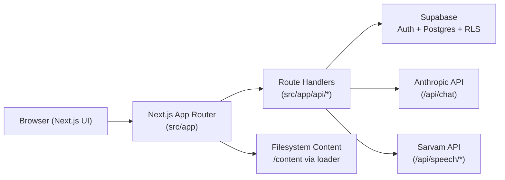

# Architecture

## System Overview
NucleuX Academy is a single Next.js 16 App Router application that combines frontend pages and backend API handlers in one codebase.

Core pillars:
- Route-grouped UI (`src/app/(marketing)`, `src/app/(auth)`, `src/app/(app)`)
- Internal APIs (`src/app/api/*`)
- File-based medical content under `/content`
- Supabase auth + persistence
- ATOM AI via Anthropic chat API
- Speech services via Sarvam APIs

## Application Shell
- Root layout: `src/app/layout.tsx`
- Auth and user contexts are mounted globally:
  - `src/lib/auth-context.tsx`
  - `src/lib/contexts/UserContext.tsx`
- PWA capabilities are enabled via:
  - `src/components/pwa/ServiceWorkerRegistration.tsx`
  - `public/sw.js`
  - `src/app/manifest.ts`

## Routing Model
- Public marketing routes: `src/app/(marketing)/*`
- Public auth routes: `src/app/(auth)/*`
- Protected app routes: `src/app/(app)/*`
- API routes: `src/app/api/*/route.ts`

Access control:
- Middleware gate: `src/middleware.ts`
- Supabase session refresh: `src/lib/supabase/middleware.ts`
- Auth redirects and client-side protection: `src/lib/auth-context.tsx`

## Data and State Architecture

### Server-backed data (Supabase)
Used for profiles, preferences, streaks, progress, study sessions, and analytics summaries.

Main tables (from `supabase/combined-migration.sql` and migrations):
- Identity/profile: `profiles`, `user_preferences`, `streaks`
- Learning content/progress: `atoms`, `mcqs`, `mcq_attempts`, `user_atom_progress`, `study_sessions`, `daily_stats`
- Learning lifecycle (Phase 1): `learning_topics`, `learning_chunks`, `learning_stage_runs`, `learning_artifacts`, `learning_checkpoints`
- Curriculum/progression: `competencies`, `competency_progress`, `pathways`, `user_pathways`, `pathway_progress`
- Community/notes and related: `discussions`, `comments`, `user_notes`, etc.
- Telemetry events: `analytics_events` (from `supabase/migrations/004_analytics_events.sql`)

### Client-backed state (localStorage)
- User learning profile cache: `src/lib/contexts/UserContext.tsx`
- Analytics event stream and memory-strength model: `src/lib/analytics/store.ts`
- Optional cloud sync bridge: `src/lib/analytics/context.tsx` to `/api/analytics/sync`
- Learning method stores (`prestudy/aim/shoot/skin/mindmap`) are localStorage-first with:
  - debounced write-through sync via `src/lib/learning/client-sync.ts` to `/api/learning/*`
  - stage-run/checkpoint auto-linking for stage completion
  - topic-load cloud hydration via `src/lib/learning/hydration.ts` (invoked from `src/app/(app)/library/[subject]/[subspecialty]/[topic]/TopicClient.tsx`)

## Content Architecture
Content is loaded from filesystem, not from a CMS.

Primary loader:
- `src/lib/content/loader.ts`

Resolution behavior:
1. Subject + subspecialty directory in `/content`
2. Mapping-based resolution via `src/lib/data/content-mapping.ts`
3. Numbered-prefix fallback matching
4. Legacy TypeScript topic fallback via `src/lib/data/topics/index.ts`

Library routes:
- Subject: `src/app/(app)/library/[subject]/page.tsx`
- Subspecialty: `src/app/(app)/library/[subject]/[subspecialty]/page.tsx`
- Topic: `src/app/(app)/library/[subject]/[subspecialty]/[topic]/page.tsx`

## API Architecture
API handlers live in route handlers and are called directly from frontend hooks/components.

Main consumers:
- Hooks: `src/lib/api/hooks.ts`
- Analytics provider: `src/lib/analytics/context.tsx`
- Chat surfaces: `src/app/(app)/chat/page.tsx`, `src/components/AtomWidget.tsx`, `src/components/AtomLibrarian.tsx`, classroom tools

High-impact APIs:
- `/api/profile`, `/api/progress`, `/api/study-plan`, `/api/study-sessions`, `/api/analytics`, `/api/chat`, `/api/library/content`, `/api/speech/stt`, `/api/speech/tts`
- Learning lifecycle APIs: `/api/learning/topics`, `/api/learning/topics/[topicId]/chunks`, `/api/learning/stage-runs`, `/api/learning/artifacts`, `/api/learning/checkpoints`

## AI and Speech

### Chat (ATOM)
- Endpoint: `src/app/api/chat/route.ts`
- Provider: Anthropic (`ANTHROPIC_API_KEY`)
- Retrieval strategy:
  - Keyword + synonym expansion
  - Scoped file search under `/content`
  - Context injection into a system prompt

### Speech
- Endpoints:
  - `src/app/api/speech/stt/route.ts`
  - `src/app/api/speech/tts/route.ts`
- Provider wrapper: `src/lib/speech/sarvam.ts`
- Required key: `SARVAM_API_KEY`

## Operational Boundaries
- Build command runs CBME validation before Next build (`npm run build` -> `scripts/validate-cbme-links.ts`).
- CI currently enforces `lint:stabilization` and production build (`.github/workflows/ci.yml`).
- Optional smoke e2e runs in CI when `E2E_EMAIL` and `E2E_PASSWORD` secrets are present.

## Route Maturity
Not all routes are equally backend-integrated in this snapshot. Some are production data-backed, while others remain static/mock-first UX shells.

Reference:
- `docs/ROUTE-STATUS.md`
