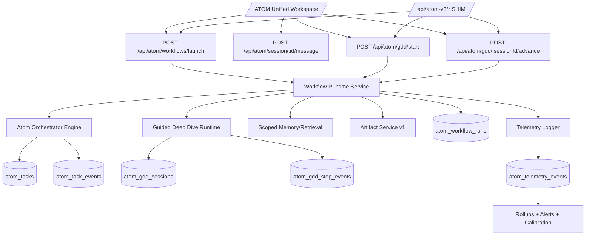

# Phase 9 Technical Architecture — Vishwakarma Blueprint

**System:** NucleuX Academy / ATOM
**Baseline:** Phase A–E implemented and conformant
**Target:** Unified production-grade V3 runtime under canonical ATOM APIs

---

## 1) Architecture intent

Phase 9 introduces a **unified workflow runtime** that sits above current ATOM session/task subsystems and standardizes all mode execution paths.

Current pain points being solved:
- Split API families (`/api/atom/*` vs `/api/atom-v3/*`).
- Launch and GDD logic partially scaffolded/gated.
- Orchestrator includes stub path not suitable as production default.

Desired architecture properties:
- Single contract family (`/api/atom/*`).
- Deterministic run lifecycle with idempotency.
- Full telemetry and quality-loop coverage.
- Strict continuity with A–E safety constraints (scope, RLS, governance).

---

## 2) Logical architecture (target)

---

## 3) Backend design

## 3.1 New runtime layer

**New module:** `src/lib/atom/runtime/`

Proposed components:
- `runtime-types.ts`
  - `WorkflowMode`, `RunStatus`, `RunPhase`, `RunFailureCode`
- `state-machine.ts`
  - transition guards (queued→running→needs_input/completed/failed/cancelled)
- `workflow-launcher.ts`
  - validates mode payload, creates run record, enqueues/starts execution
- `run-executor.ts`
  - calls orchestrator/GDD engine based on workflow type
- `event-publisher.ts`
  - appends sequenced events with dedupe/idempotency keys

### Invariants
- Every run has one authoritative `run_id`.
- Every event has monotonically increasing sequence within run scope.
- Terminal state is immutable (except explicit retry creating new run revision).

---

## 3.2 Orchestrator refactor

Existing `src/lib/atom/orchestrator.ts` already contains:
- deep research execution path
- task event append
- stub runner path

Phase 9 changes:
- move shared event/state update logic into runtime services.
- keep deep-research business logic, but route through runtime executor.
- de-emphasize `runAtomOrchestratorStub()` from production path.
- introduce explicit error taxonomy:
  - `validation_error`
  - `retrieval_error`
  - `provider_error`
  - `artifact_persist_error`
  - `unexpected_runtime_error`

---

## 3.3 API surface (canonical)

### New/updated canonical endpoints
- `POST /api/atom/workflows/launch`
  - starts any workflow (`chat`, `nucleux-original`, `guided-deep-dive`, etc.)
- `GET /api/atom/workflows/:runId`
  - run status snapshot (optional but recommended)
- `GET /api/atom/workflows/:runId/events`
  - stream/poll run events (optional if task events reused)
- `POST /api/atom/gdd/start`
- `GET /api/atom/gdd/:sessionId`
- `POST /api/atom/gdd/:sessionId/advance`

### Compatibility layer
- Keep `/api/atom-v3/launch` and `/api/atom-v3/gdd/*` as wrappers calling canonical handlers.
- Add response header: `X-ATOM-Deprecated: true`.
- No breaking payload changes until Phase 10 deprecation window ends.

---

## 4) Frontend architecture

## 4.1 Workspace composition

Current `/atom` uses `LegacyAtomWorkspace` as default.

Target:
- Introduce `AtomUnifiedWorkspace` with shared panels extracted from legacy:
  - source selector panel
  - conversation/timeline/output pane
  - profile + quality panel
- Unify launch + conversation wiring through canonical APIs.
- Keep `LegacyAtomWorkspace` as fallback via feature flag.

## 4.2 Interaction model

1. Doctor enters intent/topic.
2. UI calls `POST /api/atom/workflows/launch`.
3. UI subscribes to run/task events.
4. Outputs pane updates from events and artifact fetch.
5. Feedback writes continue through `/api/atom/feedback`.

## 4.3 UX hard requirements
- Display run phase and confidence state (green/amber/red).
- Show actionable retry/continue controls only when supported.
- Preserve session hydration behavior from current `/api/atom/session/threads` + `/session/:id` APIs.

---

## 5) Data model changes (Supabase)

## 5.1 New tables

### `atom_workflow_runs`
Purpose: canonical run ledger across launch modes.

Suggested fields:
- `id uuid pk`
- `user_id uuid not null`
- `scope_key text not null`
- `session_id uuid null`
- `task_id uuid null`
- `workflow_mode text not null`
- `status text not null` (queued/running/needs_input/completed/failed/cancelled)
- `current_phase text null`
- `input_payload jsonb not null`
- `orchestration_metadata jsonb not null default '{}'::jsonb`
- `idempotency_key text null`
- `started_at timestamptz null`
- `completed_at timestamptz null`
- `error_code text null`
- `error_message text null`
- `created_at timestamptz default now()`
- `updated_at timestamptz default now()`

Indexes:
- `(user_id, created_at desc)`
- `(scope_key, created_at desc)`
- unique partial on `(user_id, idempotency_key)` when key not null

### `atom_gdd_sessions`
Purpose: durable guided deep dive state.

Suggested fields:
- `id uuid pk`
- `user_id uuid not null`
- `scope_key text not null`
- `topic text not null`
- `level text not null`
- `goal text not null`
- `status text not null`
- `current_step text not null`
- `state jsonb not null`
- `created_at timestamptz default now()`
- `updated_at timestamptz default now()`

### `atom_gdd_step_events`
Purpose: append-only step telemetry/debug timeline.

Suggested fields:
- `id bigserial pk`
- `session_id uuid not null references atom_gdd_sessions(id)`
- `seq int not null`
- `event_type text not null`
- `payload jsonb not null default '{}'::jsonb`
- `created_at timestamptz default now()`

Unique:
- `(session_id, seq)`

---

## 5.2 RLS model

Follow Phase A–E pattern:
- user can access rows where `user_id = auth.uid()`.
- service role/admin paths only where operationally needed.
- no cross-scope reads without explicit admin path and audit telemetry.

---

## 6) Telemetry and observability extension

## 6.1 New telemetry events

Add to telemetry contract:
- `workflow.launch.requested`
- `workflow.launch.accepted`
- `workflow.run.phase_started`
- `workflow.run.phase_completed`
- `workflow.run.completed`
- `workflow.run.failed`
- `gdd.session.started`
- `gdd.session.advanced`
- `gdd.session.completed`

Each event carries:
- `scope_key`, `run_id`, `session_id`, `task_id`, `workflow_mode`, `cohort`, `latency_ms`, `error_code?`.

## 6.2 Rollups

Add rollups by:
- mode × cohort × status
- phase duration distribution
- failure reasons distribution
- GDD completion funnel

## 6.3 Alert thresholds

Start conservative:
- failure rate > 8% (15-min window) → warning
- failure rate > 15% (15-min window) → critical
- p95 launch latency > 2500ms → warning
- scope guard failures > 0 → critical

---

## 7) Security and governance controls

- Preserve canonical scope derivation (`user-scope.ts`) in all new endpoints.
- Enforce session ownership checks before linking run/task/session.
- Redact sensitive payload fields before telemetry insert.
- Compatibility shims must not bypass policy guardrails.
- Add audit log entries for deprecated endpoint usage volume.

---

## 8) Performance and reliability

- Add idempotency for launch requests (prevents duplicate runs from retries).
- Use bounded polling/event streaming with reconnect snapshot endpoint.
- Keep artifact writes atomic (event emitted only after persistence success).
- Ensure state transition retries are safe (compare-and-set on status when needed).

---

## 9) Testing strategy (must-pass)

## Unit
- runtime state transition tests
- idempotency key behavior
- GDD session state progression

## Route integration
- canonical workflow launch route tests
- shim equivalence tests (`/atom-v3/*` vs `/atom/*`)
- scope collision tests on new tables/routes

## Reliability
- extend `scripts/atom-reliability-smoke.ts` to include workflow launch + GDD progression

## Regression gates
- existing:
  - `test:atom:route-smoke`
  - `test:atom:dedup`
  - `test:atom:reliability`
- new:
  - `test:atom:runtime-state-machine`
  - `test:atom:workflow-api-compat`

---

## 10) Deployment architecture and feature flags

Recommended new flags:
- `PHASE9_RUNTIME_ENABLED` (global switch)
- `PHASE9_UNIFIED_UI_ENABLED` (frontend default switch)
- `PHASE9_CANARY_COHORT` (CSV of user IDs / cohort tags)
- `PHASE9_V3_SHIM_DEPRECATION_WARN` (log warnings for shim usage)

Rollout order:
1. migration + dark deploy
2. runtime enabled for internal cohort only
3. unified UI enabled for internal cohort
4. expand cohorts after telemetry stability

---

## 11) Backward compatibility policy

For one full phase window:
- keep `atom-v3` routes alive as wrappers.
- no response schema breaking changes.
- document deprecation in API docs.
- add usage counter; retire only when usage < 5% sustained.

---

## 12) Architectural decision update

Add ADR in `docs/product/09-DECISIONS-LOG.md` post-implementation:
- **ADR-012:** “Retire ADR-011 by promoting V3 runtime to canonical ATOM workflow engine with compatibility shims.”

---

## 13) Implementation-ready summary

Phase 9 architecture is an additive, low-risk consolidation:
- no destructive changes to A–E foundations,
- introduces one canonical runtime,
- keeps reversible switches,
- adds full observability,
- and prepares Phase 10 cleanup/deprecation.
